# Hyperbook: a complete intro to Hyperapp for those who have 4 hours to spare

This tutorial/mini-book gives you full coverage of Hyperapp - a tiny framework for building web interfaces.

## How to read it

To benefit the most, read sections in order. I will explain every single concept with code, images and words. 
Later sections will build upon the previous ones, so don't skip anything.

## How long does it take

You will need about 4 hours because this document is 7 times longer than Hyperapp [source code](https://github.com/jorgebucaran/hyperapp/blob/master/src/index.js).

## Prerequisites

* HTML, CSS, JS
* Basics of Functional Programming in JS:
    * pure functions and programming without side effects
    * higher-order functions
    * currying
    * immutability
* Some familiarity with browser DevTools (HTML elements tab, network tab, performance tab)  will be beneficial   
* Some familiarity with other JS frameworks will be beneficial    

No prior experience with Hyperapp is needed.

## Why do we need another framework?

<figure>
    
    <figcaption><em>Figure: Rube Goldberg Machine - a metaphore for accidental complexity</em></figcaption>
    <br><br>
</figure>


> We have lost our ability of achieving more with less. We do more with more. Or, in certain cases, we do less with more.

Modern frontend development is too complicated:
* frameworks with 10000k+ LOC, impenetrable to non-core developers
* libraries with huge API surface area
* more and more JS "the bad parts" to learn
* complex tooling to make everything work
* layers upon layers of abstraction on top of the browser
* elaborate performance tricks to improve performance
* code mixing side-effects and application logic 
* testing techniques with mock imports encouraging untestable code

## What is your elevator pitch?

<figure>
    
    <figcaption><em>Figure: Hyperapp Elevator Pitch</em></figcaption>
    <br><br>
</figure>


```
For JS developers. 
Who need to build highly interactive Web interfaces  
Hyperapp is a functional view and state management framework
That allows for writing easy to understand, performant and testable code
Unlike other JS frameworks
Hyperapp fits in one 500 LOC file with zero dependencies and facilitates programming in a tiny subset of JS "the very best parts"
```
In this tutorial I'll try to back up this bold statement. 

## Learning outcomes

By the end of this tutorial you will learn to:
* develop frontend code using mostly pure functions and object literals 
* setup build tool free development workflow to avoid tooling fatigue
* render views as simple functions, not stateful components
* model application state to make impossible states impossible
* change application state with pure functions
* talk to HTTP APIs and stream server events without callbacks, promises, async/await, observables in the user space
* describe all side effects (e.g. random number generation) as data structures
* optimize load time and runtime performance 
* test your application at the unit and integration level
* deploy your code to production
* render frontend views on the server
* route between different pages
* integrate with 3rd party libraries
* appreciate the benefits of minimalist approach to software development

## Introducing the problem

You will be building a messaging/chat application called **HyperPosts**. I decided to choose a boring and familiar domain purposefully. 
To ease the learning process you will only focus on the framework concepts instead of learning new and unfamiliar domain.

You will find a deployed version of this app on netlify: https://hyperposts.netlify.app/

You will find source code on github: https://github.com/kwasniew/hyperbook-tutorial

The following two figures show 2 screens you'll be building:
* main screen with a post submit form and a list of posts streamed from the server
* login screen to set your username

<figure>
    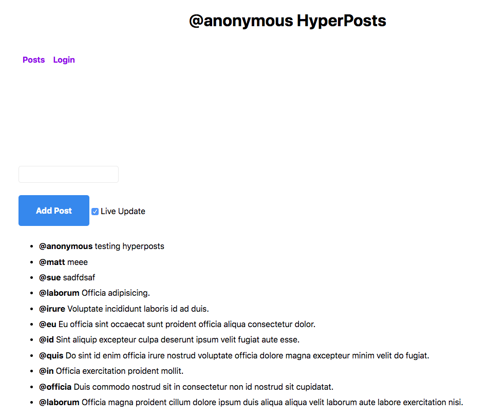
    <figcaption><em>Figure: Hyperposts main screen</em></figcaption>
    <br><br>
</figure>

<figure>
    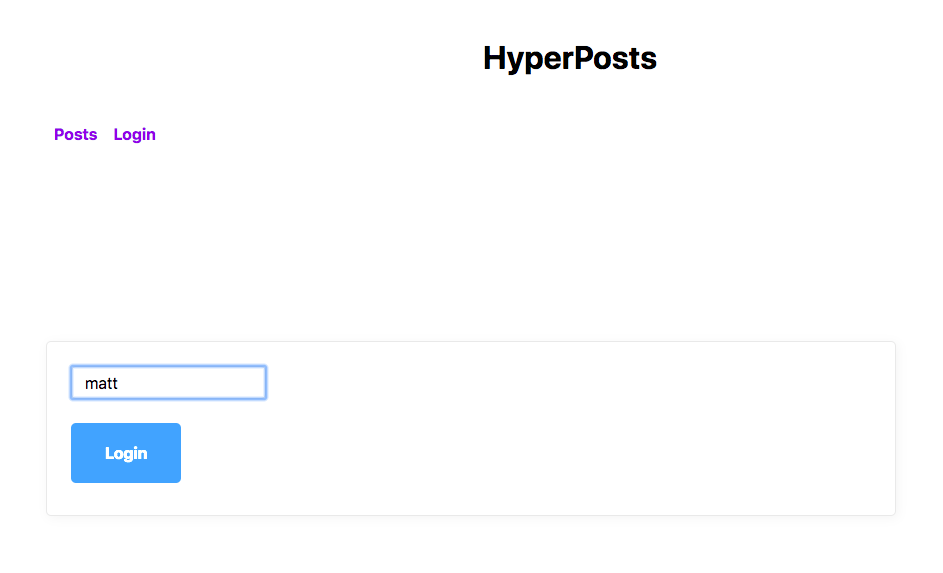
    <figcaption><em>Figure: Hyperposts login screen</em></figcaption>
    <br><br>
</figure>


## Getting started

When learning a new framework it's important to understand every single step you take and every single line of code you write. 
Instead of generating boilerplate, you'll write everything yourself. 

With more Hyperapp experience, you may formalize the setup into your own starter kit. 
However, you may also realize the starter kit is no longer necessary with certain sources of complexity eliminated.

Create empty **src** directory with **index.html** and **App.js**. You will name JS files with first uppercase letter. 

**index.html**
```html
<!DOCTYPE html>
<html lang="en">
<head>
    <meta charset="UTF-8">
    <meta name="viewport" content="width=device-width, initial-scale=1" />
    <title>HyperPosts</title>
    <link rel="stylesheet" href="https://andybrewer.github.io/mvp/mvp.css">
    <script type="module" src="App.js"></script>
</head>
<body>
    <main>
        <div id="app"></div>
    </main>
</body>
</html>
```
HTML links to **App.js** as ES6 module (```type="module"```), therefore you can use ES6 imports in JS code. 
Hyperapp will render its content into ```<div id="app"></main>```.


**App.js**
```javascript
import {h, app} from "https://unpkg.com/hyperapp?module";

const state = {text: "Welcome to Hyperapp!"};

app({
    init: state,
    view: state => h("h1", {id: "my-header"}, state.text),
    node: document.getElementById("app")
});
```
To start experimenting, you can fetch Hyperapp directly from CDN (e.g. unpkg.com). 
The exported module provides two functions: ```h``` and ```app```.

The **app** function is your main integration point with the framework. 
Pass an object with 3 parameters:
* **init** - initial state of your application
* **view** - view function rendering current state
* **node** - DOM node to mount the application to

Expose your **src** directory using any static HTTP server. I'm using https://www.npmjs.com/package/http-server 
```
npm i http-server -G
http-server src
```

By default ```http-server``` starts on http://127.0.0.1:8080

Check if you browser renders the same HTML as shown in the figure:
<figure>
    
    <figcaption><em>Figure: Getting started HTML</em></figcaption>
    <br><br>
</figure>

## Understanding view function

<figure>
    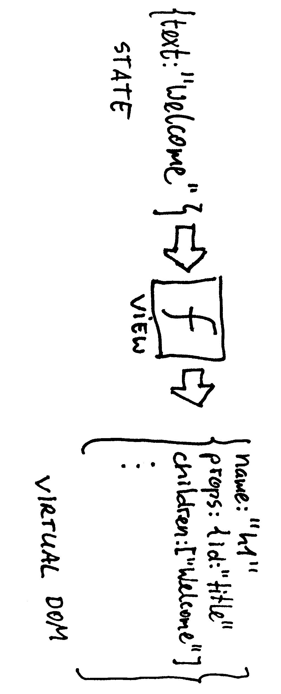
    <figcaption><em>Figure: View as a function of state</em></figcaption>
    <br><br>
</figure>

In the functional approach to UI development, view is a pure function of state. 
Hyperapp ```view``` function takes ```state``` object as an input and returns a data structure describing future DOM tree to build. 
The returned data structure is known as the **Virtual DOM**. The framework can translate it into very efficient low-level DOM updates. 
The important point is that you never work directly with DOM API in your application code. 
Instead of making imperative calls such as ```document.createElement```, ```element.insertBefore``` or ```element.removeChild``` you declare
what the view should look like and let the framework figure out the details.  

## Analyzing view rendering options

View function needs to build a Virtual DOM data structure. You have at least 3 options to choose from:
* ```h```
* ```JSX``` translating to ```h``` at build time
* ```htm``` translating to ```h``` at runtime or build time


### h

Currently your application uses built-in **h** function to make Virtual DOM nodes.
Change your view function to wrap the text in a ```span``` element:
```javascript
state => h("h1", {id: "my-header"}, [h("span", {}, state.text)])
```
Check the generated HTML:
```html
<h1 id="my-header"><span>Welcome to Hyperapp!</span></h1>
```

What about something more complicated? How much effort would it take to translate the following snippet into ```h``` function calls?
```html
<div>
    <h1>Recent Posts</h1>
    <ul>
        <li>
            <strong>@js_developers</strong>
            <span>Modern JS frameworks are too complicated</span>
        </li>
        <li>
            <strong>@jorgebucaran</strong>
            <span>There, I fixed it for you!</span>
        </li>
    </ul>
</div>
```
Translating between HTML and ```h``` function calls can get tiresome for nested HTML. 
Even if you automate the process, you still have to mentally switch between JS representation and HTML representation you see in DevTools.
On the other hand if you write everything from scratch and prefer JS-driven templating, calling ```h``` function directly is a solid option. 

### JSX 

[JSX](http://facebook.github.io/jsx/) is a language extension that originated in the React circles. It allows to write JS code that looks like HTML:
```jsx
view: state => <h1 id="my-header"><span>{state.text}</span></h1>
```

To make JSX work, you need to run a transpiler from JSX to ```h``` function calls. 
If adding a build step to your development process is not your thing, we have one more option.

Note: Hyperapp is dropping support for ```JSX``` soon. 

### htm

[htm](https://github.com/developit/htm) is a tiny library with HTML-like syntax and no build tool requirement. 
If you want to replace ```htm``` with ```h``` calls in production, you can use ```babel-plugin-htm```.

Change you **App.js** code to use ```htm```:
```javascript
import {h, app} from "https://unpkg.com/hyperapp?module";
import htm from 'https://unpkg.com/htm?module';

const html = htm.bind(h);

const state = {text: "Welcome to Hyperapp!"};

app({
    init: state,
    view: state => html`<h1 id="my-header"><span>${state.text}</span></h1>`,
    node: document.getElementById("app")
});
```
```htm``` connects to Hyperapp via ```bind``` function. Write your HTML inside ```html``` tagged template. Under the hood ```htm``` translates everything to the low-level ```h``` function calls.

```htm``` works with any Virtual DOM framework matching the signature:
```javascript
function buildVirtualNode(type, props, ...children) {}
```
```h``` function happens to match the signature.

## Using Hyperapp from npm

Using modules directly from CDN is convenient for simple experiments. 
However, for the regular development you want to have local version of all dependencies. 
Why? Because sometimes CDNs:
* go down
* are slow to respond
* have security breaches
* go out of business

Additionally, local dependencies allows for offline work.

Create **package.json** in your root directory:
```json
{
  "dependencies": {
    "htm": "3.0.4",
    "hyperapp": "2.0.4"
  }
}
```
Put the same versions of dependencies as this tutorial to avoid surprises.

Install dependencies:
```
npm i
```
On quick inspection of **node_modules** you'll find no transitive dependencies. Both ```htm``` and ```hyperapp``` bring no extra guests
to the party.

You can try to reference npm dependencies from **App.js**:
```javascript
import {h, app} from "hyperapp";
import htm from "htm";
```
But unfortunately browsers can't resolve those dependencies.

Since both ```hyperapp``` and ```htm``` are zero-dependency libraries you can load them from **node_modules**:
```javascript
import {h, app} from "../node_modules/hyperapp/src/index.js";
import htm from "../node_modules/htm/dist/htm.mjs";
```
It certainly works, but I had to inspect the contents of both libraries to provide correct paths.

## Integrating Hyperapp with Snowpack 

[Snowpack](https://www.snowpack.dev/) is a tool to translate selected ```node_modules``` into browser friendly bundles at dependency installation time.
It puts all dependencies as single file bundles in a predictable location called ```web_modules```. 
It also has experimental support for deep imports so all transitive dependencies are resolved as a single browser-friendly file. 
Deep imports work for libraries using ```require``` and [Node.js ESM modules](https://nodejs.org/api/esm.html). The latter means your dependency needs
to use ```.js``` extension in import statements.  
In essence Snowpack makes bundling JS optional at development time.

Update **package.json** with this ```snowpack``` setup:
```json
{
  "scripts": {
    "snowpack": "snowpack install --dest=src/web_modules",
    "postinstall": "npm run snowpack"
  },
  "dependencies": {
    "htm": "3.0.4",
    "hyperapp": "2.0.4"
  },
  "devDependencies": {
    "snowpack": "2.0.0-beta.20"
  }
}
```
Snowpack is our development dependency. It provides ```snowpack install``` command that will run after ```npm i``` from the ```postinstall``` script. 
You tell snowpack to put the browser friendly bundles in ```src/web_modules```. Without ```--dest```  it would put everything in the root-level
```web_modules```. Since we serve the whole ```src``` directory everything needs to be inside.

Rewrite your imports to use ```web_modules```:
```
import {h, app} from "./web_modules/hyperapp.js";
import htm from "./web_modules/htm.js";
```
 
Run the installation command:
```npm i```

Snowpack will inspect your code and translate required modules from ```node_modules``` to ```web_modules```.

If you track your code in git add **src/web_modules** to **.gitignore**.

## Formatting code with prettier 

[Prettier](https://prettier.io/) is an opinionated code formatter saving your code review time for things that really matter. 
The days of spaces vs tabs wars are over.

Add ```format``` command and ```prettier``` ```devDependency``` to **package.json**:
```json
{
  "scripts": {
    "snowpack": "snowpack install --dest=src/web_modules",
    "postinstall": "npm run snowpack",
    "format": "prettier --write '**/!(web_modules)/*.js'"
  },
  "dependencies": {
    "htm": "3.0.4",
    "hyperapp": "2.0.4"
  },
  "devDependencies": {
    "prettier": "2.0.5",
    "snowpack": "2.0.0-beta.20"
  }
}
```
```format``` command willl format your JS files except from the ```web_modules``` (excluded explicitly) and ```node_modules``` (excluded by default).
With the ```--write``` option it will re-write the formatted files in place.


Copy this malformed code to **App.js**:
```javascript
import { h, app } from "./web_modules/hyperapp.js";
import htm from "./web_modules/htm.js";

const html = htm.bind(h);

const state = { text: "Welcome to Hyperapp!" };

app({
  init: state,
  view: (state) => html`
<div>
    <h1>Recent Posts</h1>
    <ul>
      <li>
        <strong>@js_developers</strong>
        <span>Modern JS frameworks are too complicated</span>
      </li>
      <li>
        <strong>@jorgebucaran</strong>
        <span>There, I fixed it for you!</span>
      </li>
    </ul>
</div>
`,
  node: document.getElementById("app"),
});
```
The opening ```div``` is not aligned properly.

After running:
```
npm run format
```
The ```view``` code should get nicely aligned.

You can connect prettier to your IDE/text editor to format on save, but it's beyond the scope of this tutorial.

You took a detour to learn about some tools that play nicely with Hyperapp:
* ```htm``` for HTML-like syntactic sugar
* ```snowpack``` for browser friendly dependencies
* ```prettier``` for consistent code formatting

In the next section we're back to your app.

## Splitting view into smaller functions

In the previous section you rendered static HTML independent of the application state. 
The next code snippet shows how to iterate over a list of items in a view function:

```javascript
import { h, app } from "./web_modules/hyperapp.js";
import htm from "./web_modules/htm.js";

const html = htm.bind(h);

const state = {
  posts: [
    {
      username: "js_developers",
      body: "Modern JS frameworks are too complicated",
    },
    { username: "js_developers", body: "Modern JS frameworks are too heavy" },
    { username: "jorgebucaran", body: "There, I fixed it for you!" },
  ],
};

const listItem = (post) => html`
  <li>
    <strong>@${post.username}</strong>
    <span> ${post.body}</span>
  </li>
`;

const view = (state) => html`
  <div>
    <h1>Recent Posts</h1>
    <ul>
      ${state.posts.map(listItem)}
    </ul>
  </div>
`;

app({
  init: state,
  view,
  node: document.getElementById("app"),
});
```
```view``` is extracted into a separate function.
Inside the ```view``` you map over a list of ```posts``` and render each of them using ```listItem``` view fragment. 
As a rule of thumb, if your view gets too big, split it into **smaller view fragments**. 
Pass as much state as needed. For example: ```listItem``` only needs a single ```post``` parameter.

At the end of this section your view should look like this:
<figure>
    
    <figcaption><em>Figure: Displaying a list of posts</em></figcaption>
    <br><br>
</figure>

## Changing state with actions

**Actions** bring interactivity to your application. As users click buttons or type some text, you want to react to those events.

First, add a button just below the ```h1``` element:
```javascript
<h1>Recent Posts</h1>
<button onclick=${AddPost}>Add Post</button>
```
The ```onclick``` translates to DOM API click event. 
More precisely, Hyperapp translates the ```onclick``` into ```button.addEventListener('click')```. 
Everything you know about DOM API is still relevant and transferable. 
There's no extra framework-specific events to learn.

Add the action itself. Put it between the state and view declarations:
```javascript
const AddPost = (state) => {
  const newPost = { username: "anonymous", body: "fixed text" };
  return { ...state, posts: [newPost, ...state.posts] };
};
```
```AddPost``` is a pure function mapping previous state to the new state. 
When you click a button, Hyperapp automatically passes previous state to your action. 
```newPost``` is created and added to the beginning of the posts list. 
A common pattern is to destructure previous state and only update those properties that change. 
Our current state has no other properties, but the code is future proofed. 
To keep your state updates simple, model your state as flat objects. The more nesting you do, the more
elaborate update strategies you will need (e.g. [lenses](https://randycoulman.com/blog/2016/07/12/thinking-in-ramda-lenses/)). 

The following figure shows the same action in a visual format:
<figure>
    
    <figcaption><em>Figure: Action is a pure function of state</em></figcaption>
    <br><br>
</figure>


Test your app in the browser and click the "Add Post" button several times. New items should be added to the list.

<figure>
    
    <figcaption><em>Figure: AddPost action adding new items to the list</em></figcaption>
    <br><br>
</figure>

## Understanding functional data flow

Hyperapp **data flow** is inspired by the [Elm Architecture](https://guide.elm-lang.org/architecture/):
* view **V** interaction (e.g. click) triggers some action **A** 
* action **A** changes state **S**
* state **S** change re-renders the view **V**

<figure>
    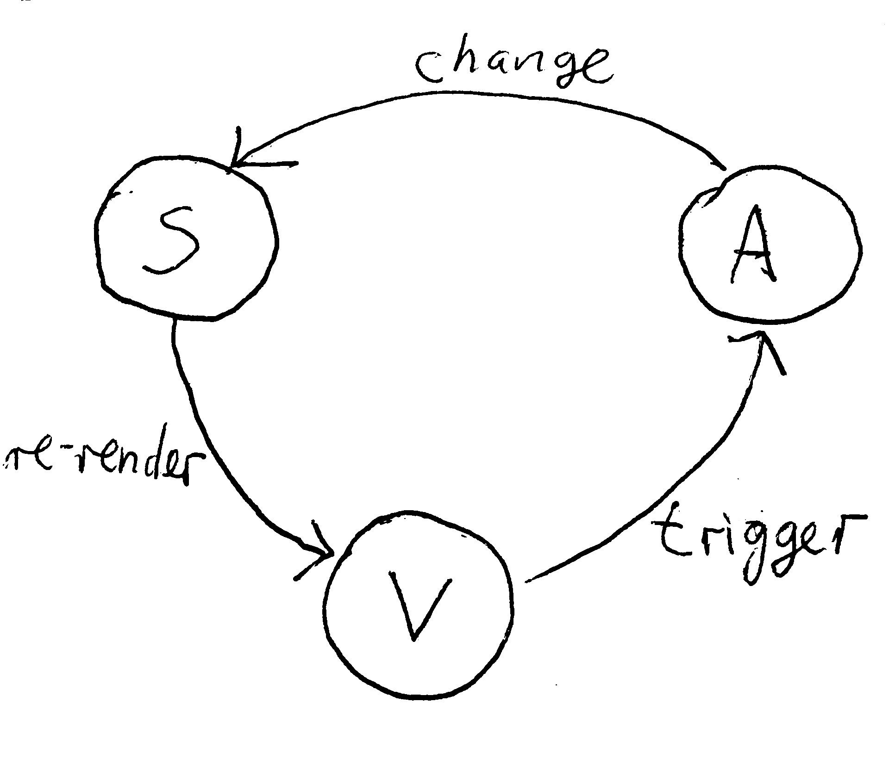
    <figcaption><em>Figure: Functional data flow</em></figcaption>
    <br><br>
</figure>

As a Hyperapp user you declare all the views, actions and the initial state. 
Hyperapp connects the circles and takes care of:
* handling events
* dispatching actions
* re-rendering the view

This approach makes your code very declarative as you never have to perform fine-grain view updates. 
At any given time, your view is the HTML/DOM projection of your current state.
And state is the ultimate source of truth. 
In other words, state is not spread across many JS components or even worse, in the DOM itself.

Note: with Hyperapp there's no need to use classes extending from a framework superclass or to decorate your code with framework specific annotations. 
View and actions are pure functions and state is a plain JS object. 
Therefore, cognitive overhead from unnecessary language features is minimal.

## Modelling state

You already implemented a button click action. It always adds a post with the same text. 

Add an input field to change the text:
```javascript
<h1>Recent Posts</h1>
<input type="text" autofocus />
<button onclick=${AddPost}>Add Post</button>
```

When you start typing some text, your state and view will get out of sync. What you're typing is not
reflected in the state change.
One of the tenets of functional UI architecture is continuous synchronization of state and view. 
View reacting to state changes, and state changes reacting to view actions. 
To make this work, you need some part of your state to model the contents of the input field. 

Create a new state property named ```currentPostText```:
```javascript
const state = {
  currentPostText: "type your text",
  posts: [...]
};
```
Read the new property in your view:
```javascript
<input type="text" value=${state.currentPostText} autofocus />
```
DOM attribute called ```value``` sets the text of the input field to the ```currentPostText```.

## Accessing DOM events

Input text reflects ```currentPostText``` from the state object. You want to close the circle with DOM events changing the state.

Add DOM ```oninput``` attribute to trigger ```UpdatePostText``` action on input changes:
```javascript
<input type="text" oninput=${UpdatePostText} value=${state.currentPostText} autofocus />
```

Add a new action next to the ```AddPost``` action:
```javascript
const UpdatePostText = (state, event) => ({
    ...state,
    currentPostText: event.target.value
});
```
Compare ```UpdatePostText``` signature with ```AddPost``` signature.

```
(oldState) => newState
(oldState, event) => newState
```
Hyperapp actions accept either ```(oldState)``` or ```(oldState, event)```. 
With a second attribute provided, Hyperapp will inject both sources of information to your action.
The ```event``` is a regular DOM event, therefore we can access ```event.target.value``` from DOM Event API. 
As mentioned before, it's all about transferable skills. 

The following figure shows updated conceptual model of Hyperapp actions with an extra event parameter:
<figure>
    
    <figcaption><em>Figure: Action is a pure function of state and event</em></figcaption>
    <br><br>
</figure>

Try to add a new post with some text. It should still not work. You need to copy the ```currentPostText``` to the newly added post.

```javascript
const AddPost = (state) => {
  const newPost = { username: "anonymous", body: state.currentPostText };
  return { ...state, posts: [newPost, ...state.posts] };
};
```

With this change, you can start adding custom messages to the list.

<figure>
    
    <figcaption><em>Figure: Adding custom messages to the list</em></figcaption>
    <br><br>
</figure>

## Extracting repetitive event data

All event based actions will follow similar pattern:
```javascript
(oldState, event) => {
    const userData = event.target.value;
    ....
}
```
Action code would be cleaner if it didn't know about DOM Event API.

Create a **selector function** to extract part of the event you care about:
```javascript
const targetValue = event => event.target.value;
```
Eventually, you'll move this code to a library but for now put it somewhere above your view declarations.

Switch ```UpdatePostTest``` to use the new function:
```javascript
const UpdatePostText = (state, event) => ({
    ...state,
    currentPostText: targetValue(event)
});
```
The code is still dependent on the ```targetValue``` function.

Ideally, you'd like the action to accept only the data it needs:
```javascript
const UpdatePostText = (state, currentPostText) => ({
    ...state,
    currentPostText
});
```
Shape the second argument of your action inside the input handler. 
```javascript
<input type="text" oninput=${[UpdatePostText, targetValue]} value=${state.currentPostText} autofocus />
```
A two argument array with an action and a selector applies the event selector before the action is invoked. 
In our case ```targetValue``` is applied to DOM event before invoking ```UpdatePostText```.

If you keep using the ```[action, selector]``` array over and over, consider creating an alias:
```javascript
const UpdatePostTestAction = [UpdatePostText, targetValue];
```
As you don't have a second usage of this pattern yet, withhold this decision for now. 

## Exercise: cleaning text input

According to [modern reaserch](https://en.wikipedia.org/wiki/Desirable_difficulty), testing your knowledge is essential for learning. 
If you want to get the most out of this tutorial please do the exercises. They are not optional.

Your application doesn't clear the input text after adding a new post.
Modify the ```AddPost``` action to reset ```currentPostText```. 
Also make sure the initial text is empty.
When you're done compare with the solution below.
But first, try to do it on your own. 

<details>
    <summary id="cleaning_text_input">Solution</summary>

```javascript
const AddPost = (state) => {
  const newPost = { username: "anonymous", body: state.currentPostText };
  return { ...state, currentPostText: "", posts: [newPost, ...state.posts] };
};
```

</details>

## Exercise: checking empty input

After we clean the input, users may be tempted to submit empty text. Your task is to prevent them from doing so.
Application should ignore **Add Post** clicks when the text is empty.

<details>
    <summary id="checking_empty_input">Solution</summary>

```javascript
const AddPost = (state) => {
  if(state.currentPostText.trim()) {
      const newPost = { username: "anonymous", body: state.currentPostText };
      return { ...state, currentPostText: "", posts: [newPost, ...state.posts] };
  }  else {
      return state;
  }
};
```

</details>

## Understanding "effects as data"

All actions you've seen so far were simple state transitions from one data structure to the other. 
However in real-world scenarios your application will probably have to deal with side effect e.g. making HTTP calls to some API. 
A common functional approach to side-effects is to move them to the edges of the system. 

Imagine the following hypothetical code you could write:
```javascript
const SetPosts = (state, posts) => ({
  ...state,
  posts
});
const LoadLatestPosts = (state) => fetch("https://hyperapp-api.herokuapp.com/api/post").then(SetPosts);
```
```LoadLatestPosts``` uses browser fetch API to get data from the server. 
When data arrives it invokes simple state transition function to set the posts in a local state. 
Since ```fetch``` causes side effects (going over the wire with HTTP) it makes your entire program side-effectful. 
It only takes one innocent ```fetch``` call to make the code impure.

Another thought experiment is to represent the effect as a data structure:
```javascript
const SetPosts = (state, posts) => ({
  ...state,
  posts
});
const LoadLatestPosts = {
  url: "https://hyperapp-api.herokuapp.com/api/post",
  action: SetPosts
};
```
```LoadLatesPosts``` is an object with API ```url``` and follow-up ```action``` to invoke after the fetch completes. 
Ideally we'd like to pass this object to Hyperapp and let it get the posts from the API on our behalf. 
We don't want to fetch the data ourselves in the userland code. 
This is the essence of moving impure code to the edges of the system. Framework does the impure part, while your code stays very declarative. 

But how should Hyperapp know how to interpret this object? 

<figure>
    
    <figcaption><em>Figure: Hyperapp can't interpret arbitrary data</em></figcaption>
    <br><br>
</figure>


There's no way it can possibly translate arbitrary JS objects to every single side-effect you can imagine. 
That's why it doesn't even try. Instead, you must pass side-effect definition and the effect data as a two-argument array.

```javascript
const LoadLatestPosts = [effectDefinition, {
  url: "https://hyperapp-api.herokuapp.com/api/post",
  action: SetPosts
}];
```

Side-effects in Hyperapp are made of effect definition and effect data:
```javascript
[effectDefinition, data]
```

The effect definition will hide the ```fetch``` call or some other impure call, but you will never invoke it in the userland code.
It's something you must return to the framework, so it can handle the impure part.

<figure>
    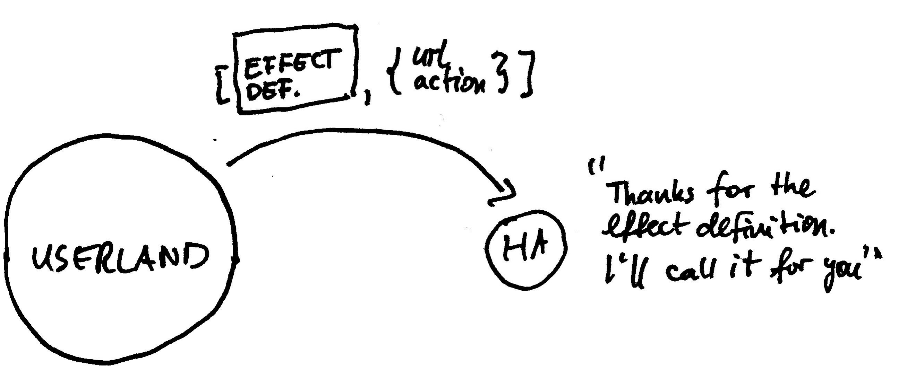
    <figcaption><em>Figure: Hyperapp handling effect definitions from the userland</em></figcaption>
    <br><br>
</figure>

## Implementing "effects as data"

In this section you'll use an open source library [hyperapp-fx](https://github.com/okwolf/hyperapp-fx) that implements the most common effects. 
In the next section we'll peek under the hood and build your own effects.

In **App.js** add ```LoadLatestPosts``` effect that invokes ```SetPost``` action on successful response:
```javascript
import { Http } from "./web_modules/hyperapp-fx.js";

const SetPosts = (state, posts) => ({
  ...state,
  posts
});

const LoadLatestPosts = Http({
  url: "https://hyperapp-api.herokuapp.com/api/post",
  action: SetPosts
});
```
```Http``` function takes your effect data and builds a two argument array with ```[httpEffectDefinition, effectData]```.

Add ```hyperapp-fx``` and let Snowpack bundle it for the browser:
```
{
  "dependencies": {
    "htm": "3.0.4",
    "hyperapp": "2.0.4",
    "hyperapp-fx": "2.0.0-beta.1"
  }
}
```

```npm i```

## Triggering effects on application startup

With HTTP effect defined you must decide when to invoke it. For now, you'll do it on application startup to start fetching posts early.

Modify ```init``` to invoke ```LoadLatestPosts```:
```javascript
app({
  init: [state, LoadLatestPosts],
  ...  
});
```
```init``` has overloaded signature. In addition to the initial state you can pass one or more actions to invoke on startup.
```init``` value is like the result of an action, which can be either a state or state+effects. 

With those changes in place test your application. A list of posts from the server should arrive and replace the hardcoded posts. 
You may observe a content flip as Hyperapp replaces initial state with the server posts.

<figure>
    
    <figcaption><em>Figure: Loading initial posts</em></figcaption>
    <br><br>
</figure>

If everything works fine, replace the initial posts with an empty array:
```javascript
const state = {
  posts: []
};
```
It will remove the initial flip.

## Writing your own effects

Most of the time you don't need to write your own effects. However, to better understand the underlying concepts implement
```Http``` effect yourself.

Comment out this line of code:
```javascript
// import { Http } from "./web_modules/hyperapp-fx.js";
```

Your own implementation of the effect should build an array with the effect definition and effect data.
```javascript
const Http = data => [httpEffect, data];
```
Hyperapp expects two-parameter signature in the effect definition:
```javascript
const httpEffect = (dispatch, data) => {};
```

A simple implementation of the HTTP effect may look like this:
```javascript
const httpEffect = (dispatch, data) => {
  return fetch(data.url)
      .then(response => response.json())
      .then(json => dispatch(data.action, json));
};
```
As an effect library author you translate the side-effectful API call (e.g. ```fetch```) into a ```dispatch``` call.  
Hyperapp will invoke this effect and inject a ```dispatch``` function. You will never call it directly in the application code.

Our original post-fetch action definition looked like this:
```javascript
const SetPosts = (state, posts) => ({
  ...state,
  posts
});
```
```dispatch``` call will replace the second parameter with JSON data from the API. 
The first parameter will be a regular state object that we used before.

Test your own implementation of the Http effect. 
If everything works, uncomment the original ```Http``` effect from the library and delete your implementation.

```javascript
import { Http } from "./web_modules/hyperapp-fx.js";
```

## Understanding effectful actions

```LoadLatestPosts``` alias for the ```Http``` effect is invoked on application startup. What if we wanted to trigger ```Http``` effects from regular actions?

Create ```SavePost``` effect:
```javascript
const SavePost = (post) =>
  Http({
    url: "https://hyperapp-api.herokuapp.com/api/post",
    options: {
      method: "post",
      headers: {
        "Content-Type": "application/json",
      },
      body: JSON.stringify(post),
    },
    action: (state, data) => state,
  });
```
This effect wraps HTTP POST. The action to be triggered on successful response is not doing anything yet.

To trigger this effect from an action use the following signature: 
```javascript
const EffectfulAction = oldState => [newState, Effect];
```
This is how you create **effecftul actions**.

Hyperapp applies the new state and schedules the effect almost instantly. 
The return action inside the effect will trigger eventually e.g. when the HTTP response arrives.

If you have more than one effect wrap them in an array:
```javascript
const EffectfulAction = oldState => [newState, [Effect1, Effect2]];
```
Or pass directly comma-separated at the end of the main array:
```javascript
const EffectfulAction = oldState => [newState, Effect1, Effect2];
```

## Exercise: making effectful action

Change ```AddPost``` action to trigger ```SavePost``` effect.  Do it every time a post is added to the local state.
Use network tab to verify if the request is sent:
<figure>
    
    <figcaption><em>Figure: Sending JSON payload to the server</em></figcaption>
    <br><br>
</figure>

<details>
    <summary id="making_effectful_action">Solution</summary>

```javascript
const AddPost = state => {
  if (state.currentPostText.trim()) {
    const newPost = { username: "anonymous", body: state.currentPostText };
    const newState = { ...state, currentPostText: "", posts: [newPost, ...state.posts] };
    return [newState, SavePost(newPost)];
  } else {
    return state;
  }
};
```

</details>

## Understanding long running effects (subscriptions)

The HTTP effect you've been using so far was **short-lived**. A request is sent, a response arrives and the effect is over.
Not all effects follow this pattern. E.g. if you open a connection to a WebSocket it will be running for a long time.
It doesn't fit the the short-lived HTTP request-response model. 

In Hyperapp you use **subscriptions** to handle those **long-lived** effects. 

To build intuition about subscriptions look at the different even sources that fit the model:
* WebSockets
* setInterval
* mouse moves
* keyboard key presses
* history/URL changes 

What they have in common is a long-lived nature of the underlying event source. 

Note: I'll refer to short-live effects as just effects and to long-lived effects as subscriptions.

## Implementing subscriptions

In this section you will subscribe to the WebSocket stream with post updates.

Import subscription definition:
```javascript
import { Http, WebSocketListen } from "./web_modules/hyperapp-fx.js";
```
```hyperapp-fx``` uses ```*Listen``` convention to name subscription creating functions.

Write an action for handling incoming WebSocket events:
```javascript
const SetPost = (state, event) => {
  try {
    const post = JSON.parse(event.data);
    return {
      ...state,
      posts: [post, ...state.posts],
    };
  } catch (e) {
    return state;
  }
};
```
The event is the underlying ```MessageEvent``` from the WebSocket API. You parse the ```data``` property of the event. 
If the data is a valid JSON post, you add it to the beginning of the post list. In case of a parsing error you don't change the state of the application.

Plug the subscription and the action into the application:
```javascript
app({
  init: [state, LoadLatestPosts],
  view,
  subscriptions: (state) => [
    WebSocketListen({
      action: SetPost,
      url: "ws://hyperapp-api.herokuapp.com",
    }),
  ],
  node: document.getElementById("app"),
});
```
```WebSocketListen``` function expects an object with ```action``` and ```url```.
Since WebSockets is a different protocol from HTTP, the URL scheme is ```ws://``` not ```http://```.

Test your application. Add a new post. 

<figure>
    
    <figcaption><em>Figure: Adding post twice</em></figcaption>
    <br><br>
</figure>

The post should be added to the list twice. 
Directly from the local state update and a few milliseconds later from a WebSocket. 
You'll fix this behavior in the next exercise. 
For now, test your WebSocket connection in two different browser windows. See if the messages are propagated correctly.

Diagnosing problems with WebSockets:
* make sure the HTTP protocol was switched to WebSockets

<figure>
    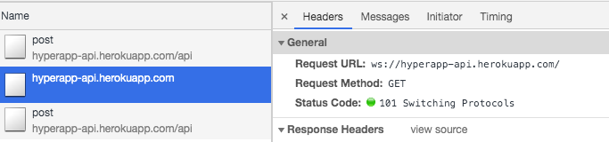
    <figcaption><em>Figure: Switching protocols</em></figcaption>
    <br><br>
</figure>

* click on the switching protocols raw and find the actual message

<figure>
    
    <figcaption><em>Figure: Inspecting WebSocket messages</em></figcaption>
    <br><br>
</figure>

## Exercise: avoiding duplicate posts

Your task is to change the code, so that it only adds a post from the WebSocket. 
Modify ```AddPost``` action and stop adding ```newPost``` until we receive a confirmation from the server.

<details>
    <summary id="avoiding_duplicate_posts">Solution</summary>

Inside ```AddPost``` action change this line:
```javascript
    const newState = {
      ...state,
      currentPostText: "",
      posts: [newPost, ...state.posts],
    };
```
To this:
```javascript
    const newState = {
      ...state,
      currentPostText: ""
    };
```

</details>

## Writing your own subscription

In this section you'll write your own subscription for [Server-Sent Events](https://www.smashingmagazine.com/2018/02/sse-websockets-data-flow-http2/).

Server-Sent Events (SSE) is a lesser known, but much simpler HTTP-native alternative to WebSockets. 
SSE also handles network failures more gracefully than plain WebSockets. It can automatically reconnect on failed connections.

In [Writing your own effects](#writing-your-own-effects) section you defined effects as follows:
```javascript
const httpEffect = (dispatch, data) => {};
```

Start with the same signature for the subscription definition:
```javascript
const eventSourceSubscription = (dispatch, data) => {};
```

The Web API for SSE is called the ```EventSource```:
```javascript
const es = new EventSource("https://hyperapp-api.herokuapp.com/api/event/post");
es.addEventListener("message", event => /* handle event with a data field */)
```
```EventSource``` is a regular event emitter similar e.g. to a clickable button.

Wrap the API into your subscription definition:
```javascript
const eventSourceSubscription = (dispatch, data) => {
  const es = new EventSource(data.url);
  es.addEventListener("message", (event) => dispatch(data.action, event));
};
```
```data``` parameter will hold two configuration options: ```url``` and ```action```. 
We follow the same convention that was used in WebSockets implementation. When SSE notification arrives, dispatch an ```action``` and pass the server ```event```.

In [Writing your own effects](#writing-your-own-effects) section you used the following effect signature:
```javascript
const Http = data => [httpEffect, data];
```

Following the same convention create your own subscription:
```javascript
const EventSourceListen = data => [eventSourceSubscription, data];
```

Plug the subscription into your application:
```javascript
app({
  init: [state, LoadLatestPosts],
  view,
  subscriptions: (state) => [
    EventSourceListen({
      action: SetPost,
      url: "https://hyperapp-api.herokuapp.com/api/event/post",
      event: "post",
    }),
  ],
  node: document.getElementById("app"),
});
```
Because you followed the same naming convention for ```action``` and ```url``` it should be just a matter of switching ```url``` and ```WebSocketListen``` to ```EventSourceListen```.

Test your application. It should work the same way as the WebSocket version, but without switching to a different protocol. 

Diagnosing problems with SSE:
* make sure the ```eventsource``` connection-type was established

<figure>
    
    <figcaption><em>Figure: Establishing SSE connection</em></figcaption>
    <br><br>
</figure>

* check SSE messages

<figure>
    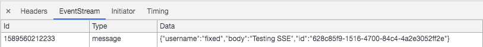
    <figcaption><em>Figure: Checking SSE messages</em></figcaption>
    <br><br>
</figure>

If your browser [doesn't support SSE](https://caniuse.com/#search=eventsource) use a polyfill:
```html
<script src="https://polyfill.io/v3/polyfill.min.js?features=fetch%2CEventSource%2Cdefault" defer></script>
```

## Understanding differences between init effect and subscription

Looking at our subscription signature it's not much different from any short-live effect. 
You could event plug the subscription into the init:
```javascript
app({
    init: [state, [LoadLatestPosts, EventSourceListen({action: SetPost, url: 'https://hyperapp-api.herokuapp.com/api/event/post'})]],
    ...
});
```
Both the short-lived ```LoadLatestPosts``` action and long-lived ```EventSourceListen``` subscription are invoked on startup.

If you never need to stop listening to the long-running event source, the subscription is effectively the same as the init action.
The moment you need to stop listening to the event source they start to differ.

## Unsubscribing from subscriptions

Subscriptions are long-lived effects you can unsubscribe from. Return the code to unsubscribe from the subscription definition.
```javascript
const eventSourceSubscription = (dispatch, data) => {
   return () => {
      // unsubscribe here
   };
};
```

Fill in this template with your ```EventSource``` implementation:
```javascript
const eventSourceSubscription = (dispatch, data) => {
  const es = new EventSource(data.url);
  const listener = (event) => dispatch(data.action, event);
  es.addEventListener("message", listener);

  return () => {
    es.removeEventListener("message", listener);
    es.close();
  };
};
```
The unsubscribe function removes a listener from the ```EventSource``` and closes the connection. 
```addEventListener``` and ```removeEventListener``` need a reference to the same listener instance. Therefore, put the listener in a shared variable.

## Controlling subscription status

You will add a capability to enable/disable live updates through the UI as shown in the following figure:

<figure>
    
    <figcaption><em>Figure: Live Update control</em></figcaption>
    <br><br>
</figure>

Introduce intial state field called ```liveUpdate```:
```javascript
const state = {
  currentPostText: "",
  posts: [],
  liveUpdate: true
};
```
By default **Live Update** will be enabled.

Add an action to toggle live update:
```javascript
const ToggleLiveUpdate = state => ({...state, liveUpdate: !state.liveUpdate});
```

Add UI control for live update just below the **Add Post** button.
```javascript
    <input
      type="checkbox"
      id="liveUpdate"
      onchange=${ToggleLiveUpdate}
      checked=${state.liveUpdate}
    />
    <label for="liveUpdate">Live Update</label>
```
The checkbox reflects ```liveUpdate``` status. Every time the checkbox changes it toggles the status.
Label for the input field conveniently allows for clicking **Live Update** text to change the settings.

Control your subscription based on the ```liveUpdate``` status.
```javascript
app({
  init: [state, LoadLatestPosts],
  view,
  subscriptions: (state) => [
    state.liveUpdate &&
      EventSourceListen({
        action: SetPost,
        url: "https://hyperapp-api.herokuapp.com/api/event/post",
        event: "post",
      }),
  ],
  node: document.getElementById("app")
});
```
When ```state.liveUpdate``` is ```true``` a new subscription gets created. When ```state.liveUpdate``` is ```false```  you unsubscribe and close the connection.

## Exercise: fetching latest posts on toggle

When the **Live Update** is off you may loose some posts. Therefore, when a user enables the update load the latest posts.
Modify ```ToggleLiveUpdate``` to ```LoadLatestPosts``` when appropriate.

<details>
    <summary id="fetching_posts_on_toggle">Solution</summary>

```javascript
const ToggleLiveUpdate = (state) => {
  const newState = {
    ...state,
    liveUpdate: !state.liveUpdate,
  };
  return newState.liveUpdate ? [newState, LoadLatestPosts] : [newState]
};
```

</details>

## Handling slow API

Switch ```SavePost``` to a new url with the slow API.
```javascript
const SavePost = (post) =>
  Http({
    url: "https://hyperapp-api.herokuapp.com/slow-api/post",
    ...
  });
```
When you test the app ```SavePost``` should take about 3 seconds before a notification arrives. 
While waiting for the response you can send more requests without getting confirmation that the previous ones succeeded. 
Assume you have a requirement to disable the **Add Post** button while the post is saving.

Enhance initial state with the ```isSaving``` property.
```javascript
const state = {
  currentPostText: "",
  posts: [],
  liveUpdate: true,
  isSaving: false
};
```

Map the property to the button ```disable``` property:
```javascript
<button onclick=${AddPost} disabled=${state.isSaving}>Add Post</button>
```
The button reflects the current state of the saving operation.

```AddPost``` action disables the button:
```javascript
const AddPost = (state) => {
    ...
    const newState = {
      ...state,
      currentPostText: "",
      isSaving: true,
    };
    ...
};
```

```SavePost``` effectful action enables the button on a successful response.
It invokes a newly created ```PostSaved``` action:
```javascript
const PostSaved = (state) => ({ ...state, isSaving: false });

const SavePost = (post) =>
  Http({
    ...
    action: PostSaved,
  });
```

Test your disable button capability.

<figure>
    
    <figcaption><em>Figure: Disabling Add Post button on submit</em></figcaption>
    <br><br>
</figure>

## Handling API errors

Switch ```SavePost``` to a new url with API returning error responses.
```javascript
const SavePost = (post) =>
  Http({
    url: "https://hyperapp-api.herokuapp.com/error-api/post",
    ...
  });
```
The new API is not only slow, but also returns 500 errors.

Enhance initial state with the ```error``` property:
```javascript
const state = {
  currentPostText: "",
  posts: [],
  liveUpdate: true,
  isSaving: false,
  error: ""
};
```
Eventually you will populate this field with an error value.

Expose the ```error``` in the UI:
```javascript
<div>${state.error}</div>
<button onclick=${AddPost} disabled="${state.isSaving}">Add Post</button>
```
You should put the error just above the **Add Post** button.

Add ```PostError``` action that will be triggered on HTTP errors. 
```javascript
const PostSaved = state => ({...state, isSaving: false});
const PostError = state => ({...state, isSaving: false, error: "Post cannot be saved. Please try again."});

const SavePost = (post) =>
  Http({
    ...
    action: PostSaved,
    error: PostError
  });
```
```hyperapp-fx``` ```Http``` effect has a special error field for the error handling action.
```PostError``` should enable the **Add Post** button and set the UI friendly error message. 

Test your application. 

<figure>
    
    <figcaption><em>Figure: Displaying post submission error</em></figcaption>
    <br><br>
</figure>


After the post submission the error is displayed. 
However, when you start typing a new text the error is still there. 
I'd expect the error to disappear at this point. 
You can change ```SetPost``` action to remove the error message, but in the next section you'll see a better way to model our state.

## Modeling only valid states

Take a look at the last 2 fields you added to the state:
```javascript
const state = {
  ...
  isSaving: false,
  error: ""
};
```

4 possible combinations can be triggered:
* ```isSaving: false``` and empty error (request is idle, user is typing a new message)
* ```isSaving: false``` and non-empty error (request error after form submission)
* ```isSaving: true``` and empty error (request is pending)
* ```isSaving: true``` and non-empty error (should be impossible)

The last combination should be impossible. But the way we modelled our state makes it possible. 
Of course you can write tests to verify the combination never occurs. But you can also model your state to make the impossible state impossible.

Imagine a concept of a request status.
The request status can be in 1 of 3 states:
* ```{status: "idle"}```
* ```{status: "pending"}```
* ```{status: "error", message: "Post cannot be saved. Please try again."}```

In the next section you'll implement it.

## Implementing only valid states

Introduce 3 valid states we defined in the modeling exercise and set the idle status as the initial one.
```javascript
const idle = { status: "idle" };
const saving = { status: "saving" };
const error = {
  status: "error",
  message: "Post cannot be saved. Please try again.",
};
const state = {
  ...
  requestStatus: idle
};
```
A common strategy to scale a growing state object is to split it into smaller objects and combine them.

Find all the places where you were setting ```isSaving``` and ```error``` properties and replace them with ```requestStatus```. 

```AddPost``` sets the status to ```saving```:
```javascript
const AddPost = (state) => {
    ...
    const newState = {
      ...state,
      currentPostText: "",
      requestStatus: saving
    };
    ...
};
```

```PostSaved``` sets the status to ```idle```:
```javascript
const PostSaved = (state) => ({ ...state, requestStatus: idle });
```

```PostError``` sets the status to ```error```:
```javascript
const PostError = (state) => ({ ...state, requestStatus: error });
```

Map the request status to ```errorMessage``` view fragment:
```javascript
const errorMessage = ({ status, message }) => {
  if (status === "error") {
    return html` <div>${message}</div> `;
  }
  return "";
};
```
Map the request status to the button ```disabled``` status:
```javascript
const addPostButton = ({ status }) => html`
  <button onclick=${AddPost} disabled=${status === "saving"}>Add Post</button>
`;
```

Delete those two lines:
```javascript
<div>${state.error}</div>
<button onclick=${AddPost} disabled=${state.isSaving}>Add Post</button>
```

And replace them with your new view fragments:
```javascript
${errorMessage(state.requestStatus)}
${addPostButton(state.requestStatus)}
```
A strategy to scale growing view functions is to split them into smaller view fragments and delegate to them.

## Exercise: removing error when typing a new post

Modify ```UpdatePostText``` action to remove the error when a user starts typing a new post.

<details>
    <summary id="cleaning_text_input">Solution</summary>

```javascript
const UpdatePostText = (state, currentPostText) => ({
  ...state,
  currentPostText,
  requestStatus: idle
});
```

</details>

After this part revert your API url in ```SavePost``` to: https://hyperapp-api.herokuapp.com/api/post

## Breaking from purity

"Effects/subscriptions as data" taken to the extreme means no side-effects in the userland code. 
```setTimeout``` becomes an effect, ````setInterval```` becomes a subscription. HTTP calls become effects, SSE become subscriptions. 

What about things like ```console.log``` or ```Math.random()```? 
We can wrap them inside effects, but sometimes it's more convenient to use them directly. 
Our next requirement is to add unique identifiers to the posts.

Put this ```guid``` function based on ```Math.random()``` into your code:
```javascript
const guid = () => {
    return 'xxxxxxxx-xxxx-4xxx-yxxx-xxxxxxxxxxxx'.replace(/[xy]/g, function (c) {
        var r = Math.random() * 16 | 0, v = c == 'x' ? r : (r & 0x3 | 0x8);
        return v.toString(16);
    });
}
```

Modify ```AddPost``` action to generate ```id``` for all new posts:
```javascript
    const newPost = {
      id: guid(),
      username: "anonymous",
      body: state.currentPostText,
    };
```

## Optimising long lists of items 

Our application keeps adding new posts to the top of the list. 
When Hyperapp sees a new item in the new list and compares it with the first item in the old list they differ. 
Same with the second and third and all the other items. 

<figure>
    
    <figcaption><em>Figure: Lists without keys require unnecessary Virtual DOM computations</em></figcaption>
    <br><br>
</figure>

The old items got shifted by one. We know it, but the algorithm for the Virtual DOM diffing doesn't. 
To maintain a stable list item identity between the renders add a **key** attribute.

<figure>
    
    <figcaption><em>Figure: Lists with keys skip unnecessary Virtual DOM computations</em></figcaption>
    <br><br>
</figure>

With the extra hint from the **key** attribute Hyperapp avoids re-rendering the items that got shifted by one.

Modify ```listItem``` view function to include the ```key``` attribute:
```javascript
const listItem = (post) => html`
  <li key=${post.id}>
    ...
  </li>
`;
```
Usually the best candidate for the ```key``` value is a stable identifier (e.g. guid). 
Don't use post content because it may not be unique. Don't use array index as it's not stable over re-renders.

Since ```key``` attribute is not visible in the generated DOM you can also add ```data-key``` attribute for debugging purposes:
```javascript
const listItem = (post) => html`
  <li key=${post.id} data-key=${post.id}>
    ...
  </li>
`;
```
Hyperapp internally uses ```key``` and a developer uses ```data-key```.

## Finding runtime performance bottlenecks

Switch ```LoadLatestPosts``` to fetch 1000 items when the application starts:
```javascript
const LoadLatestPosts = Http({
  url: "https://hyperapp-api.herokuapp.com/api/post?limit=1000",
  action: SetPosts,
});
```

Start typing a new post. 
On every typed charater Hyperapp has to do a Virtual DOM diffing of the entire page it controls. 
With a fast machine the typing delay may not even be noticeable. Hyperapp is often fast enough without extra optimisation. 

Go to your DevTools and slow down your CPU to make the impact of large DOM tree updates noticeable.

<figure>
    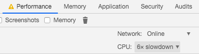
    <figcaption><em>Figure: Slowing down CPU in DevTools</em></figcaption>
    <br><br>
</figure>

Record CPU profile while typing the text. It should show significant time spent on JS execution.
I recommend to profile in the **Incognito mode** which usually has most browser extensions disabled.
Those extensions may significantly impact performance results. 

<figure>
    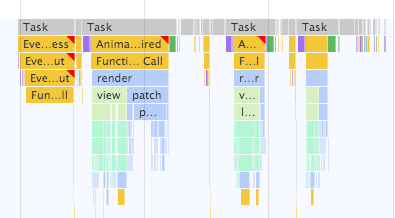
    <figcaption><em>Figure: Impact of slow CPU on runtime performance</em></figcaption>
    <br><br>
</figure>

Zoom in on the slowest part, which is the widest yellow box in the flame chart:

<figure>
    
    <figcaption><em>Figure: Zooming in on performance bottleneck</em></figcaption>
    <br><br>
</figure>

```render``` function seems to be our bottleneck. But the ```render``` function belongs to Hyperapp so keep looking for the code that you wrote. 
Just below the ```render``` function you should see a ```view``` function invoking ```listItem```  repeatedly. 
The source of our bottleneck is the ```listItem``` function invoked multiple times when we type a new post.
Excessive ```listItem``` calls result in multiple ```patch``` function calls. It's Hyperapp patching physical DOM tree to keep
up with your changes. 

## Optimizing large DOM trees 

You want to avoid the unnecessary computation of the post list items when typing a new post text. 

Extract ```postList``` view fragment:
```javascript
const postList = ({ posts }) => html`
  <ul>
    ${posts.map(listItem)}
  </ul>
`;
```
Use it in the ```view``` function:
```javascript
{postList({ posts: state.posts })}
```

Import ```Lazy``` function from Hyperapp:
```javascript
import { h, app, Lazy } from "./web_modules/hyperapp.js";
```
```Lazy``` wraps view fragments that need to be optimized.

Decorate ```postList``` with ```Lazy```:
```javascript
const lazyPostList = ({posts}) => Lazy({view: postList, posts});
```
```Lazy``` expects a ```view``` to optimize (```postList```) and other properties (```posts```) that will be passed to the ```postList```.
The optimization implemented by ```Lazy``` is  called **memoization**. 
```Lazy``` remembers the input and output of the previous ```postList``` invocation. 
If you call it again with the same input the ```postList``` doesn't compute anything and ```lazyPostList``` returns previously saved result.

Replace ```postList``` with ```lazyPostList```:
```javascript
${lazyPostList({posts: state.posts})}
```

Verify performance profile again.

<figure>
    
    <figcaption><em>Figure: Optimized view profile with shorter JS blocking time</em></figcaption>
    <br><br>
</figure>
Most key presses should generate a performance profile with much shorter JS blocking time.

```Lazy``` is the last part of Hyperapp API you need to learn.  There's nothing more. Congratulations!
After this section remove the ```limit``` query param from the API url.

In the remaining sections I'll cover extra topics that are not part of Hyperapp core, but are still useful for day to day development.
You will learn about:
* testing
* rendering on the server
* routing
* integrating with 3rd party libraries

## Understanding testable architecture

In the object-oriented programming circles people often talk about creating testable architecture that goes by different names:
* functional core, imperative shell
* ports and adapters architecture
* and many others (onion, hexagonal, clean etc.)

Lengthy books are written how to achieve the holy grail of architecture and usually much effort is required. 

Functional architecture imposed by Hyperapp makes the holy grail a default. 
As Mark Seemann noted in his [blog](https://blog.ploeh.dk/2016/03/18/functional-architecture-is-ports-and-adapters/) "functional architecture tends to fall into a pit of success".

You can visualize your app as state in the center. Actions returning new state sitting around it. And effects/subscriptions at the edges.

<figure>
    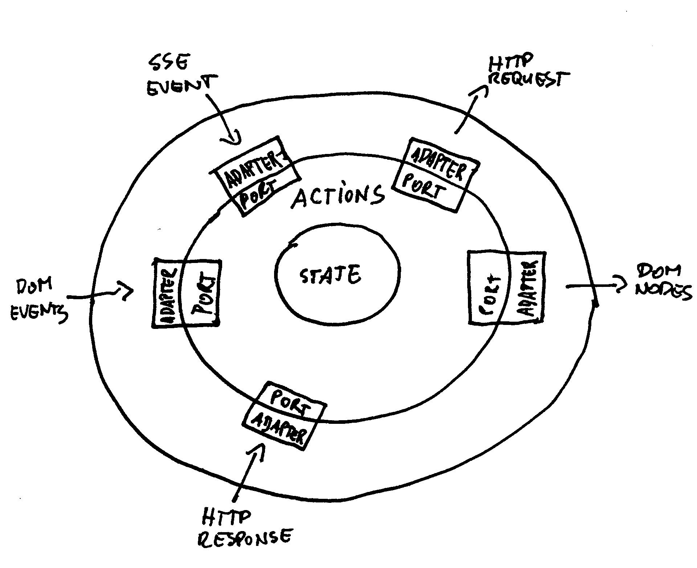
    <figcaption><em>Figure: A different look at functional architecture</em></figcaption>
    <br><br>
</figure>

Your application is as a **functional core** with pure view functions, pure actions and immutable state.  
The framework is an **imperative shell** sitting at the edges, interpreting effectful actions and handling side-effects.

The functional core makes decisions and defines the shape of your UI, the shell converts the decisions into side effects, gathers the inputs and renders physical DOM nodes.

Your effect signature is a **port** to the external world. 
The actual effect definition invoked by the framework is an **adapter**.

In terms of testability functional core allows for simple output-based unit testing:
* invoke a function
* assert on the output
* skip the mocks

## Separating framework setup from the application building blocks

To make the code easier to test separate the ```app``` call from the application building blocks: state, view, actions and subscriptions.

**App.js** should setup Hyperapp:
```javascript
import { app } from "./web_modules/hyperapp.js";
import {init, view, subscriptions} from "./Posts.js";

app({
  init,
  view,
  subscriptions,
  node: document.getElementById("app"),
});
```

**Posts.js** should export application building blocks for **App.js**:
```javascript
export const view = (state) => html`
    ...
`;

export const subscriptions = (state) => [
    state.liveUpdate &&
    EventSourceListen({
        action: SetPost,
        url: "https://hyperapp-api.herokuapp.com/api/event/post",
        event: "post",
    }),
];

export const init = [state, LoadLatestPosts];
```


## Testing simple actions

You will use ```mocha``` as a test runner and test reporter.

Why ```mocha```?
* it has **native EcmaScript Modules (ESM) support** so you don't need transpiler in testing. 
Less tooling is always good. I don't want my test framework to run my code through babel if it doesn't need to.
* it **doesn't try to be a mocking framework** encouraging questionable and magical testing practices like overwriting imports for testability. 
Relying on a test framework to mock imports is a dead end testing strategy. Your code can't be tested in other test runners. I prefer to rethink code
structure to make it testable in every test runner. 
* it has fast clean startup time that allows for **subsecond tests** without watchers. It's difficult to explain why subsecond test suite is so important
without experiencing it first-hand. I can only encourage you to give it a try. You may never want to go back to a typical slow testing setup. 
* it runs your tests in Node.js and **in a browser**

My main reservation about ```mocha``` is that it can't run plain Node.js files as tests, but it's minor nuisance compared to the benefits I mentioned before. 

Make sure you have **Node 14** or higher version installed as it ships with native ESM support.

Include those changes in **package.json**:
```json
{
    "type": "module",
    "scripts": {
      "snowpack": "snowpack install --exclude 'test/**' --dest=src/web_modules",
      "test": "mocha test/*Test.js"
    },
    "devDependencies": {
      "mocha": "7.1.2"
    }
}
```
This code:
* adds ```mocha``` as a development dependency
* tells Node.js to use ESM modules (```"type": "module"```)
* prevents ```snowpack``` from installing test dependencies
* runs ```mocha```

Write your first test in **test/PostsTest.js**:
```javascript
import assert from "assert";
import { UpdatePostText } from "../src/Posts.js";

describe("Posts:", () => {
  it("post text is updated", () => {
    const initState = {
      currentPostText: "",
      requestStatus: { status: "idle" },
    };

    const newState = UpdatePostText(initState, "text");

    assert.deepStrictEqual(newState, {
      currentPostText: "text",
      requestStatus: { status: "idle" },
    });
  });
});
```
This code uses Node.js built-in ```assert``` module. 

The test:
* prepares initial state
* invokes an action with a new post text
* verifies expected state changes

You can think of this test as 3 blocks separated by empty spaces:
* given
* when
* then

Run the test:
```npm test```

The test runner should report that ```UpdatePostText``` is not exported.

Add ```export``` keyword:
```javascript
export const UpdatePostText = (state, currentPostText) => ({
  ...state,
  currentPostText,
  requestStatus: idle,
});
```

Now the test should be green. 
One of the tradeoffs of unit testing actions is that you need to expose them in the public API of the tested module.

## Exercise: Testing simple actions

Write a unit test verifying ```UpdatePostText``` resets error request status to idle.

<details>
    <summary id="testing_actions">Solution</summary>

```javascript
  it("post status is reset to idle", () => {
    const initState = {
      currentPostText: "",
      requestStatus: { status: "error", error: "oh nooo" },
    };

    const newState = UpdatePostText(initState, "text");

    assert.deepStrictEqual(newState, {
      currentPostText: "text",
      requestStatus: { status: "idle" },
    });
  });
```

</details>

## Making actions more testable

```AddPost``` action is difficult to unit test because it relies on ```Math.random()``` for guid generation. 

More testable version would take ```id``` as an input parameter:
```javascript
const AddPost = (state, id) => {
  ...
};
```

Find usage of```AddPost``` and replace it with:
```javascript
const addPostButton = ({ status }) => html`
  <button onclick=${WithGuid(AddPost)} disabled=${status === "saving"}>
    Add Post
  </button>
`;
```
```WithGuid``` doesn't exist yet. You're only sketching ideal future API in code.

```WithGuid``` should tell Hyperapp to generate a new id and pass it to a testable action:
```javascript
const WithGuid = (action) => (state) => [state, Guid(action)];
const Guid = (action) => [
  (dispatch, action) => {
    dispatch(action, guid());
  },
  action,
];
```
```WithGuid``` is an effectful action. ```Guid``` is an effect. 
Previously you were passing configuration objects to your ```Http``` effects. 
However the ```Guid``` effect is simple and it only accepts the action to invoke. 

## Testing effectful action

Test ```AddPost``` action.
```javascript
  it("add post", () => {
    const initState = {
      currentPostText: "text",
      requestStatus: { status: "idle" },
      post: [],
    };

    const [newState, [savePostEffect, savePostData]] = AddPost(
      initState,
      "1234"
    );

    assert.deepStrictEqual(newState, {
      currentPostText: "",
      requestStatus: { status: "saving" },
      post: [],
    });
    assert.deepStrictEqual(
      savePostData.url,
      "https://hyperapp-api.herokuapp.com/api/post"
    );
  });
```
This effectful action returns new state and the effect. Destructure the effect to conveniently assert on the effect data. 
```AddPost``` should clear the ```currentPostText```, mark the request as ```saving``` and no posts should be added to the  ```post``` list yet.
For the effect part ignore ```savePostEffect``` as it's only for the framework. 
On the other hand you can verify if effect got correct data. In our case we only check the ```url```. 

To emphasize that you don't verify the effect definition, name it with ```_``` or leave a blank in the destructured array.
```javascript
const [newState, [_, savePostData]] = AddPost(initState, "1234");
const [newState, [, savePostData]] = AddPost(initState, "1234");
```

## Separating application code from library code

Before you start testing effects and subscriptions separate them from the rest of the code.
Create **src/lib** directory and move SSE and guid related code there. Remember to export appropriate functions.

**src/lib/EventSource.js**
```javascript
const eventSourceSubscription = (dispatch, data) => {
  const es = new EventSource(data.url);
  const listener = (event) => dispatch(data.action, event);
  es.addEventListener("message", listener);

  return () => {
    es.removeEventListener("message", listener);
    es.close();
  };
};
export const EventSourceListen = (data) => [eventSourceSubscription, data];
```

**src/lib/Guid.js**
```javascript
const guid = () => {
  return "xxxxxxxx-xxxx-4xxx-yxxx-xxxxxxxxxxxx".replace(/[xy]/g, function (c) {
    var r = (Math.random() * 16) | 0,
      v = c == "x" ? r : (r & 0x3) | 0x8;
    return v.toString(16);
  });
};
const Guid = (action) => [
  (dispatch, action) => {
    dispatch(action, guid());
  },
  action,
];

export const WithGuid = (action) => (state) => [state, Guid(action)];
```

In **Posts.js** you should have those imports:
```javascript
import { EventSourceListen } from "./lib/EventSource.js";
import { WithGuid } from "./lib/Guid.js";
```

## Testing effects and subscriptions

Effects and subscriptions live at the edges of the system and interact with global APIs outside of your control e.g. DOM API or Fetch API. 
Therefore, effects and subscriptions are more difficult to unit test. It's usually a job of the effect library author.

```javascript
import assert from "assert";
import { EventSourceListen } from "../src/lib/EventSource.js";

const givenEventSource = (serverUrl) => {
  const listeners = {};
  let isClosed = false;
  const es = {
    addEventListener(name, listener) {
      listeners[name] = listener;
    },
    removeEventListener(name, listener) {
      delete listeners[name];
    },
    close() {
      isClosed = true;
    },
  };
  const emit = (event) => {
    Object.values(listeners).forEach((listener) => {
      listener(event);
    });
  };

  function EventSource(url) {
    if (url === serverUrl) return es;
  }
  global.EventSource = EventSource;
  
  return { emit, isClosed: () => isClosed };
};

const runFx = ([effect, data]) => {
  const dispatch = (action, event) => (dispatch.invokedWith = [action, event]);
  const unsubscribe = effect(dispatch, data);
  return { dispatch, unsubscribe };
};

describe("Event source subscription", () => {
  const defaultEventSource = global.EventSource;
  afterEach(() => {
    global.EventSource = defaultEventSource;
  });

  it("dispatches events", () => {
    const { emit } = givenEventSource("http://example.com");
    const { dispatch } = runFx(
      EventSourceListen({ url: "http://example.com", action: "action" })
    );

    emit({ data: "event data" });

    assert.deepStrictEqual(dispatch.invokedWith, [
      "action",
      { data: "event data" },
    ]);
  });
});

```
```givenEventSource``` simulates SSE server emitting events and client side API reacting to those events.
```runFx```  simulates Hyperapp setting up a subscription and exposes ```dispatch``` mock function.
```dispatch.invokedWith``` is a convention to record mock interaction without using a mocking framework.

In the test body ```emit``` a server event. Then verify if ```dispatch``` function was invoked with the event.
After the test runs revert original ```EventSource``` in the global namespace (if there was one). 

The code and tests for effects/subscriptions are conceptually more complicated than the rest of the code. 
It's the essential complexity of the Web platform that you integrate with. 
Because this code is not very convenient to work with Hyperapp keeps it at the edges and doesn't allow your application code to get polluted. 
All those callback event listeners and eagerly resolving promises (e.g. ```fetch```) are hidden away from your application logic.

## Exercise: Testing effects and subscriptions

Write a second test that verifies if emitting an event after ```unsubscribe``` triggers no ```dispatch``` calls.
As a bonus exercise verify if connection was closed.

<details>
    <summary id="testing_effects">Solution</summary>

```javascript
  it("ignores events emitted after unsubscribe", () => {
    const { emit, isClosed } = givenEventSource("http://example.com");
    const { dispatch, unsubscribe } = runFx(
      EventSourceListen({ url: "http://example.com", action: "action" })
    );
    unsubscribe();

    emit({ data: "event data" });

    assert.deepStrictEqual(dispatch.invokedWith, undefined);
    assert.ok(isClosed());
  });
```

</details>

## Comparing integration test options

If you find yourself struggling with excessive mocking and hard to maintain tests consider integration testing your application. 
Some JS developers find their **integration tests** give them more leverage than unit tests.
Therefore they subvert a traditional [test pyramid](https://martinfowler.com/bliki/TestPyramid.html) and write more integration tests than unit tests.

One popular option for integration testing your app is DOM emulation with ```jsdom``` and polyfills/test doubles for various API such as 
```fetch```, ```localStorage``` or ```EventSource```.
This approach allows to write Node.js tests for your frontend code without spinning a browser. 
Personally, I've spent too much time trying to match browser environment in this setup and I'm not sure if it's worth the effort. 
Your mileage may vary though. Also, with ```jsdom``` you're not integration testing against a real browser. 

```jsdom``` based setup tradeoffs:
* (+) easy to run from CLI without extra tooling
* (+) faster tests in CI server than spinning-up browser tests
* (-) slow startup time for the first test which makes subsecond testing impossible
* (-) can't find browser discrepancies

Another option is to run your tests in a real browser.
With this approach all APIs just work and you can inspect a failing tests with your DevTools. 

Browser based setup tradeoffs:
* (+) testing a real browser
* (+) easy to inspect the environment after a failing tests
* (+) all APIs just work
* (+) with an open browser first test starts instantly  
* (-) cleaning the environment between tests is cumbersome
* (-) requires complex tooling to run in the CI server
* (-) with many tests it's slower than ```jsdom``` because of the rendering overhead

## Testing in a browser

```mocha``` tests run in both Node.js and in different browsers. Not all test runners have this capability. 

Create **test/index.html** with the following boilerplate:
```html
<!DOCTYPE html>
<html lang="en">
<head>
    <meta charset="utf-8" />
    <title>Mocha Tests</title>
    <meta name="viewport" content="width=device-width, initial-scale=1.0" />
    <link rel="stylesheet" href="https://unpkg.com/mocha/mocha.css" />
</head>
<body>
<div id="mocha">
    <div id="app"></div>
</div>

<script src="https://unpkg.com/mocha@7.1.2/mocha.js"></script>
<script src="https://unpkg.com/chai@4.2.0/chai.js"></script>
<script src="https://unpkg.com/browse/@testing-library/dom@7.5.6/dist/@testing-library/dom.umd.js"></script>

<script class="mocha-init">
    mocha.setup('bdd');
</script>
<script type="module" src="App.test.js"></script>
<script type="module" class="mocha-exec">
    mocha.run();
</script>
</body>
</html>
```
This setup loads 3 scripts.
* ```mocha``` - browser based test runner
* ```chai``` - assertion library. Browsers don't provide built-in assertion libraries similar to Node ```assert```
* ```@testing-library/dom``` - a helpful utility library you'll use for asynchronous rendering testing  

We load the scripts from unpkg.com. In real world setup you'd rather load them locally. Also, all scripts other than
```mocha``` could be loaded as ESM imports.

You app will mount to ```<div id="app"></div>```.

Write a test in **test/App.test.js**:
```javascript
const { assert } = chai;
const { getAllByTestId, waitFor } = TestingLibraryDom;
import { start } from "../src/App.js";

const container = () => document.getElementById("app");

describe("App", () => {
  beforeEach(function () {
    container().innerHTML = "";
  });

  it("Load initial posts", async () => {
    start();
    await waitFor(() => {
      assert.strictEqual(getAllByTestId(container(), "item").length, 10);
    });
  });
});

```
The code cleans up the app container before every test. It's important to start each test with a clean slate.
Always prefer ```beforeEach``` over ```afterEach``` for cleanup as you may need to inspect a failing test every now and then.
```afterEach``` would erase useful debugging information.

Inside a test, start a new instance of the app. Then wait for the 10 items to show up. 
```getAllByTestId``` is a utility querying for ```data-testid="item```. 
```waitFor``` runs until:
* the assertion doesn't throw any errors
* waitFor times out 
* mocha times out

Change **src/App.js**:
```javascript
import { app } from "./web_modules/hyperapp.js";
import { init, view, subscriptions } from "./Posts.js";

export const start = () =>
  app({
    init,
    view,
    subscriptions,
    node: document.getElementById("app"),
  });
```
It defers app intialization so that it can be started anew in each test.

Add **src/Start.js**:
```javascript
import { start } from "./App.js";

start();
```
Refer to this file from **src/index.html**:
```html
<script type="module" src="Start.js"></script>
```

Add the test data attribute to the ```listItem``` view fragment in **src/Posts.js**:
```javascript
const listItem = (post) => html`
  <li key=${post.id} data-key=${post.id} data-testid="item">
    ...
  </li>
`;
```

Start a server from the root directory: ```http-server .```

Open http://localhost:8080/test/ in your browser. The test should be green.

<figure>
    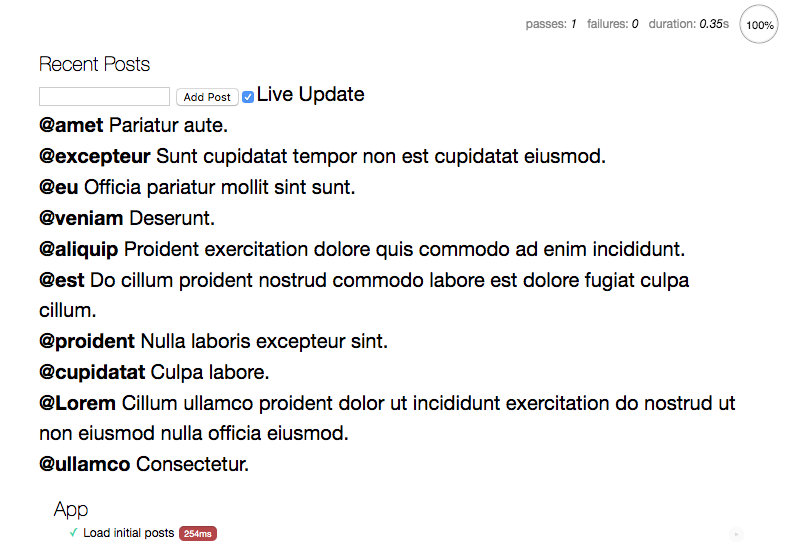
    <figcaption><em>Figure: Mocha browser test output</em></figcaption>
    <br><br>
</figure>

## Testing more advanced browser scenario

Add a test for the post submission and waiting for the SSE notification:
```javascript
const {
  getAllByTestId,
  waitFor,
  findByTestId,
  findByText,
  fireEvent,
} = TestingLibraryDom;

  const randomMessage = () => `new message ${new Date().toJSON()}`;

  const sendMessage = async (newMessage) => {
    const input = await findByTestId(container(), "post-input");
    input.value = newMessage;
    fireEvent.input(input);

    const button = await findByText(container(), "Add Post");
    button.click();
  };

  const waitForMessage = async (message) => {
    await waitFor(() => {
      assert.strictEqual(
        getAllByTestId(container(), "item")[0].textContent,
        message
      );
    });
  };

  it("Add a post as anonymous user", async () => {
    start();
    const newMessage = randomMessage();

    await sendMessage(newMessage);

    await waitForMessage(`@anonymous ${newMessage}`);
  });
```
The test starts a new app to make it independent of the other tests. 
TODO: One thing I'm missing in Hyperapp is the ability to stop all subscriptions from the previous test. 

With the app started:
* create a random message
* send the message to the server - ```@testing-library``` simplifies firing DOM events such as typing a text. It also provides DOM queries
that wait for DOM elements to appear in the UI.
* wait for the message to show up at the top of the post list 

Put a test data attribute in **Posts.js**:
```javascript
    <input
      data-testid="post-input"
      type="text"
      oninput=${[UpdatePostText, targetValue]}
      value=${state.currentPostText}
      autofocus
    />
```

Check if both tests are green.

## Making integration tests faster and more predictable

You integration test execution time and reliability are heavily dependent on the API response time and availability. 
There are at least two options to make your tests faster and more reliable:
* record all HTTP traffic with a library like [PollyJS](https://netflix.github.io/pollyjs/#/). 
The first time you run the tests it intercepts all network calls and saves them to localStorage/REST API etc. 
Afterwards it can replay the traffic much faster than the original API. When the API changes you make a new recording.
* inject fake implementation of all effects and subscriptions you want to replace. 
The trick is to move all effects and subscriptions to the entry point of your application.
In production you can start your app with real effects/subscriptions:
```javascript
import { start } from "./App.js";
import { Http } from "./web_modules/hyperapp-fx.js";
import { EventSourceListen } from "./lib/EventSource.js";
import { WithGuid } from "./lib/Guid.js";

start({Http, EventSourceListen, WithGuid});
```
In your tests your can provide fake implementation of those effects/subscriptions. 
This technique requires minor code changes. Each module with effects needs to expose a function for injecting those.
This is essentially what some people call a dependency injection. A fancy name for passing arguments to functions.
 
I leave it to the reader to experiment with those techniques.

## Analyzing routing options

In the next few sections you'll start adding a new login page. With more than a single page our system requires some kind of routing.
There are two routing options:
* server-side
* client-side

With **server-side** routing you create one app per page. Each page:
* can evolve independently
* can use a different version of a framework
* can even use a different framework
* can use only HTML/CSS when JS is not needed
* can use natural code splitting without any tools

You integrate pages together with hypermedia: links and forms. 
To read more about this architecture go to Self-Contained Systems [website](https://scs-architecture.org/).

With **client-side** routing you manage page transitions in JS and you need a client-side router. 
Most JS routers:
* hijack links and forms to prevent default browser behavior
* call ```history.pushState``` to update URL bar
* listen to ```popstate``` events to make the back button work

## Extracting htm binding

Before you build a new page extract code for binding ```htm``` to ```h```.

Create **src/Html.js**:
```javascript
import { h } from "./web_modules/hyperapp.js";
import htm from "./web_modules/htm.js";

export const html = htm.bind(h);
```

Use the ```html``` template literal in **src/Posts.js**:
```javascript
import { app, Lazy } from "./web_modules/hyperapp.js";
import {html} from "./Html.js";

// delete htm binding
// const html = htm.bind(h);
```

## Decorating view with layout and navigation

In this section you'll add a global layout with shared navigation.

First write our ideal signature for the layout decorator in **src/App.js**:
```javascript
  app({
    view: layout(view),
  });
```
```layout``` should wrap the original view function and return a new function with a state parameter.

Create **src/Layout.js** with a function matching this specification.
```javascript
export const layout = (view) => (state) => html``;
```

Fill in the gaps:
```javascript
import { html } from "./Html.js";

const nav = html`
  <nav>
    <ul>
      <li><a href="/" class="href">Posts</a></li>
      <li><a href="/login" class="href">Login</a></li>
    </ul>
  </nav>
`;

export const layout = (view) => (state) => html`
  <div>
    <header>
      <h1>HyperPosts</h1>
      ${nav}
    </header>
    <main>
      ${view(state)}
    </main>
  </div>
`;

```
```layout``` provides a common header with two navigation links.
Then it delegates main content rendering to the ```view``` function. 


Import the layout in **src/App.js** and test your app:
```javascript
import { layout } from "./Layout.js";
```

<figure>
    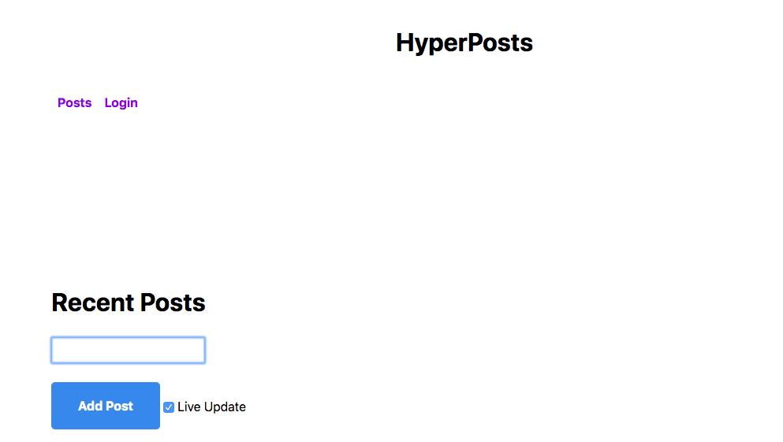
    <figcaption><em>Figure: Layout decorating main posts page</em></figcaption>
    <br><br>
</figure>

## Routing between HTML pages

To explore server-side routing create a second HTML page **src/login.html**.

```html
<!DOCTYPE html>
<html lang="en">
<head>
    <meta charset="UTF-8">
    <meta name="viewport" content="width=device-width, initial-scale=1" />
    <title>HyperPosts</title>
    <link rel="stylesheet" href="https://andybrewer.github.io/mvp/mvp.css">
    <script type="module" src="Login.js"></script>
</head>
<body>
<main>
    <div id="app"></div>
</main>
</body>
</html>
```
This is almost the same HTML you wrote for the main page. The only difference is a JS file name.

Create **src/Login.js**:
```javascript
import { app } from "./web_modules/hyperapp.js";
import { layout } from "./Layout.js";
import { html } from "./Html.js";
import { WriteToStorage } from "./web_modules/hyperapp-fx.js";

const state = {
  username: "",
};

const targetValue = (event) => event.target.value;

const ChangeLogin = (state, username) => [
  { ...state, username },
  WriteToStorage({ key: "hyperposts", value: username }),
];

const view = (state) => html`
  <form method="get" action="/">
    <input oninput=${[ChangeLogin, targetValue]} value=${state.username} />
    <button>Login</button>
  </form>
`;

app({
  init: [state],
  view: layout(view),
  node: document.getElementById("app"),
});
```
This is another Hyperapp application. 
In this tutorial we use exactly the same Hyperapp version for the login page as for the posts page. However, having two separate pages allows to evolve
framework versions independently. You don't have to upgrade all your pages at once.

The code for the login page should look familiar by now. 
The only new thing is the ```WriteToStorage``` effect from the ```hyperapp-fx``` library. 
As the user types the login we save it to the ```localStorage```. 

```WriteToStorage({key: "hyperposts", value: login})``` basically translates to ```localStorage.setItem("hyperposts", JSON.stringify(login))```.

<figure>
    
    <figcaption><em>Figure: Login page</em></figcaption>
    <br><br>
</figure>

When the user clicks the **Login** button a regular HTML form should take her to the main page.
Navigation is handled by the browser talking to the HTTP server. No JS is involved. 
It turns out browsers are really good at handling hypermedia.
You just have to make sure that JS doesn't hijack form submission. 
 

## Exercise: reading from local storage

Read the login username and set it on the posts page. 
When the user submits a new post use her actual username instead of "anonymous".

<figure>
    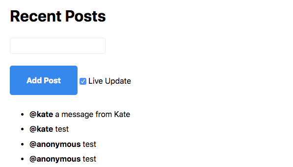
    <figcaption><em>Figure: Posts submitted with a login username</em></figcaption>
    <br><br>
</figure>

To make it easier here's a starter code for reading from storage:
```javascript
import {ReadFromStorage} from "./web_modules/hyperapp-fx.js";

const ReadLogin = ReadFromStorage({key: "hyperposts", action: ({value}) => ...})
```

<details>
    <summary id="reading_local_storage">Solution</summary>

```javascript
import { ReadFromStorage } from "./web_modules/hyperapp-fx.js";

export const state = {
  ...
  username: "anonymous",
};

export const AddPost = (state, id) => {
  ...
    const newPost = {
      id,
      username: state.username,
      body: state.currentPostText,
    };
  ...  
};

const SetUsername = (state, { value }) =>
  value ? { ...state, username: value } : state;
const ReadUsername = ReadFromStorage({
  key: "hyperposts",
  action: SetUsername,
});

export const init = [state, [LoadLatestPosts, ReadUsername]];
```

</details>

## Exercise: testing logged in user posts submission

Write an integration tests for a logged-in user posting with her login username.

Hints:
* use ```randomMessage```, ```sendMessage```, ```waitForMessage``` helper functions you already have in **App.test.js**
* remove logged-in user from ```localStorage``` before each test
* simulate logged-in user with this code ```localStorage.setItem("hyperposts", JSON.stringify("kate"));```

<details>
    <summary id="logged_in_posts">Solution</summary>

```javascript
  beforeEach(function () {
    container().innerHTML = "";
    localStorage.removeItem("hyperposts");
  });

  it("Add a post as logged in user", async () => {
    localStorage.setItem("hyperposts", JSON.stringify("kate"));
    start();
    const newMessage = randomMessage();

    await sendMessage(newMessage);

    await waitForMessage(`@kate ${newMessage}`);
  });
```

</details>

## Exercise: displaying username in the header

In this exercise you'll see the benefits of having a single application state.
Display current username in the application header as shown in the following figure:
<figure>
    
    <figcaption><em>Figure: Displaying username in the header</em></figcaption>
    <br><br>
</figure>

<details>
    <summary id="displaying_username_in_header">Solution</summary>

```javascript
export const layout = (view) => (state) => html`
  <div>
    <header>
      <h1>@${state.username} HyperPosts</h1>
      ${nav}
    </header>
    <main>
      ${view(state)}
    </main>
  </div>
`;
```

This is one of the many benefits of having a single state object instead of local component state.
Single app state approach also shines when you need to persist you entire state to localStorage or some remote API.

</details>

## Preparing for client side routing

Server-side routing is easier than client-side routing. 
You let the browser handle links, forms, history, back and forward buttons. 
However in certain scenarios you need to take over the browser's job and handle routing in JS (e.g. in offline apps). 
It results in the increased complexity of your application state and subscriptions.
With client-side routing you need to track a current page and react to navigation events.
 
First, expose init action for each of your pages:

**src/Posts.js**
```javascript
export const InitPage = (_, params) => [
  { location: params.location, ...state },
  [LoadLatestPosts, ReadUsername],
];
```
You expose a way for the router to inject the current location into the current page state. 
```InitPage``` action:
* ignores state from the previous page (```_```)
* sets initial state for the posts page (```state```) 
* fires all init effects for the posts page

Do the same thing in **src/Login.js**:
```javascript
export const InitPage = (_, { location }) => ({ location, ...state });
```
There's not effects to trigger on this page. 
Make sure to remove the ```app()``` call. You'll moving towards one centralized app setup in the next section.

Finally export the ```view``` from **Login.js**:
```javascript
export const view = (state) => html`
    ...
`;
```

## Setting up the main app

Setup you Single-Page Application in **App.js**:
```javascript
import { app } from "./web_modules/hyperapp.js";
import {
  view as postsView,
  subscriptions,
} from "./Posts.js";
import { view as loginView } from "./Login.js";
import { layout } from "./Layout.js";

const pages = {
  "/": postsView,
  "/login": loginView,
};
const view = (state) => {
  const page = pages[state.location];
  return page ? page(state) : "Loading...";
};

export const start = () =>
  app({
    init: {},
    view: layout(view),
    subscriptions,
    node: document.getElementById("app"),
  });
```
You start with mapping each path to a corresponding page.
The main view function selects a page based on ```state.location``` that you'll set in the next section.
The ```init``` is an empty object for now. You'll invoke page init actions from the router.

## Integrating with 3rd party libraries

In this section you'll integrate your code with a client-side router [page.js](https://github.com/visionmedia/page.js/). 
Hyperapp may get it's own dedicated client side router in future, but the section is still relevant.
I use it to show how Hyperapp can work with any library outside of its ecosystem. 

Add ```page.js``` to ```package.json```:
```json
  "dependencies": {
    "htm": "3.0.4",
    "hyperapp": "2.0.4",
    "hyperapp-fx": "2.0.0-beta.1",
    "page": "1.11.6"
  },
```

Looking at ```page.js``` documentation I came up with the following API calls:
```javascript
import page from "./web_modules/page.js";

page("/", fn); // register a route and call fn when a user navigates to the url
page("/login", fn);

page.start(); // start client-side routing
page.stop(); // stop client-side routing
```

Install ```page.js``` and let ```snowpack``` adjust it to the browser environment:
```npm i```

When wrapping 3rd party libraries you normally put them inside subscriptions or effects.

Create **src/Router.js** with a subscription wrapping ```page.js```:
```javascript
import page from "./web_modules/page.js";

const routeSubscription = (dispatch, data) => {
    page("/", () => {

    });
    page("/login", () => {

    });

    page.start();

    return () => {
        page.stop();
    };
};
```
Start the router when the subscription is created. Stop the router when subscription is unsubscribed from.

## Mapping 3rd party calls to Hyperapp actions

Fill in the page URL change handlers with dispatch calls.
```javascript
import page from "./web_modules/page.js";
import { InitPage as InitLoginPage } from "./Login.js";
import { InitPage as InitPostsPage } from "./Posts.js";

const SetLocation = (state, location) => ({ location });

const routeSubscription = (dispatch, data) => {
  page("/", () => {
    dispatch(SetLocation, "/");
    dispatch(InitPostsPage);
  });
  page("/login", () => {
    dispatch(SetLocation, "/login");
    dispatch(InitLoginPage);
  });

  page.start();

  return () => {
    page.stop();
  };
};
```
When a user navigates to a URL store the location. It can be used for page view selection. 
Our router has a private action ```SetLocation```. 
Next, you need to initialise a current page. 
This code depends on application specific actions and can be more generic. That's what you'll do in the next section.

## Driving router design from the outside

Start from **App.js** where you'll use the router.
```javascript
import { app } from "./web_modules/hyperapp.js";
import {
  InitPage as InitPosts,
  view as postsView,
  subscriptions,
} from "./Posts.js";
import { InitPage as InitLogin, view as loginView } from "./Login.js";
import { layout } from "./Layout.js";
import { RouteListen } from "./Router.js";

const pages = {
  "/": postsView,
  "/login": loginView,
};
const pageInitActions = {
  "/": InitPosts,
  "/login": InitLogin,
};
const view = (state) => {
  const page = pages[state.location];
  return page ? page(state) : "Loading...";
};

export const start = () =>
  app({
    init: {},
    view: layout(view),
    subscriptions: (state) => [subscriptions(state), RouteListen(pageInitActions)],
    node: document.getElementById("app"),
  });
```
Our hypothetical ```RouteListen``` subscription should be configured with ```pageInitActions``` to invoke on page transitions.

From the previous usage we can create the following **Router.js** implementation:
```javascript
import page from "./web_modules/page.js";

const routeSubscription = (dispatch, data) => {
  Object.entries(data).map(([location, init]) => {
    page(location, (context) => {
      setTimeout(() => {
        dispatch(init, { location, ...context.params });
      });
    });
  });

  page.start();

  return () => {
    page.stop();
  };
};

export const RouteListen = (data) => [routeSubscription, data];

```
```RouteListen``` is parametrized with data so you don't need to hardcode concrete page init actions anymore. 
In the subscription definition iterate over the config object and register a handler for each of the pages. 
Surprisingly, you need to wrap a dispatch call in ```setTimeout```. 
Current Hyperapp implementation expects asynchronous calls to dispatch, otherwise it goes into the infinite loop. 
This behavior may change in future versions. 

Test the navigation between the two pages. All anchor tags should be handled client-side. 
```page.js``` hijacks browser links so you don't need to create custom link element. 
However, when you submit your login a full page reload happens. 
```page.js``` doesn't handle forms, only links.
Therefore, you need to create a custom action for the form submission. You'll do this next.

## Wrapping 3rd party library into effects

You can wrap 3rd party libraries not only into subscriptions, but also into one-off effects and effectful actions.

Add the ```Navigate``` action to **Router.js**:
```javascript
const navigateEffect = (location) => [
  (_, location) => {
    page(location);
  },
  location,
];
export const Navigate = (location) => (state) => [
  state,
  navigateEffect(location),
];
```
```page(location)``` navigates to a given URL. 

Use the action in **Login.js**:
```javascript
import {Navigate} from "./router.js";

export const view = (state) => html`
  <form method="get" action="/" onsubmit=${Navigate("/")}>
    ...
  </form>
`;
```

If you test the code it still wouldn't work. A default browser submit still fires. In the next section you'll prevent it.

## Preventing browser events

Add a little helper library ```@hyperapp/events```:
```
  "dependencies": {
    ...
    "@hyperapp/events": "0.0.4"
  },
```

Use it in **Login.js**
```javascript
import {preventDefault} from "./web_modules/@hyperapp/events.js";

export const view = (state) => html`
  <form method="get" action="/" onsubmit=${preventDefault(Navigate("/"))}>
    ...
  </form>
`;
```
```preventDefault``` decorates any event based action. The wrapping action calls ```event.preventDefault()``` 
and delegates everything else to the original action.

Install your new dependency:
```npm i``` 

Now your client-side navigation should work.

## Separating client dependencies from server dependencies

In the next section you'll be adding server-side code living in the same codebase as Hyperapp client-side code.

So far you've been using Snowpack to inspect all production code for imports and translating appropriate ```node_modules``` to ```web_modules```.
It leads to 2 problems:
* you install the same dependency twice: in the ```node_modules``` and in the ```web_modules```.
* you have to exclude server code from the translation

Snowpack comes with a feature called [webDependencies](https://www.snowpack.dev/#webdependencies).

Change your **package.json**:
```
{
  "type": "module",
  "scripts": {
    "snowpack": "snowpack install --exclude '**/*' --dest=src/web_modules",
    "postinstall": "npm run snowpack",
    "format": "prettier --write '**/!(web_modules)/*.js'",
    "test": "mocha test/*Test.js"
  },
  "dependencies": {
    "hyperapp-render": "3.2.0"
  },
  "webDependencies": {
    "@hyperapp/events": "0.0.4",
    "htm": "3.0.4",
    "hyperapp": "2.0.4",
    "hyperapp-fx": "2.0.0-beta.1",
    "page": "1.11.6"
  },
  "devDependencies": {
    "mocha": "7.1.2",
    "prettier": "2.0.5",
    "snowpack": "2.0.0-beta.20"
  }
}
```
After this split:
* server-side dependencies come from ```dependencies```. I already added a ```hyperapp-render``` dependency you'll be using in the next section. 
* client-side dependencies come from ```webDependencies```. I moved all previous dependencies here.

Also, we exclude all code from import analysis (```--exclude '**/*'```). In our new workflow all client-side dependencies have to be listed explicitly in ```webDependencies```.

Test the install:
```npm i```

<figure>
    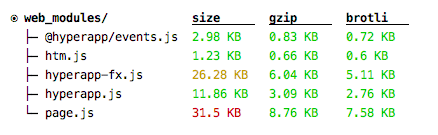
    <figcaption><em>Figure: Snowpack web_modules installed from webDependencies</em></figcaption>
    <br><br>
</figure>

## Rendering view and state into a string

So far you've been using Hyperapp to serialize Virtual DOM nodes into DOM nodes. 

However, you can also translate Hyperapp Virtual DOM to HTML string with a help of a library called [hyperapp-render](https://github.com/kriasoft/hyperapp-render).

Create **Server.js** in a root directory of your project (one level above **src**):
```javascript
import render from "hyperapp-render";
import { state, view } from "./src/Posts.js";

const html = render.renderToString(view(state));

console.log(html);
```
Make sure your **src/Posts.js** exports main view function and the initial state. 
```hyperapp-render``` should serialize your view and state into HTML string.

Run it in Node.js:
```node Server.js```

## Rendering view and state from HTTP server

You've just seen how to turn your Hyperapp views and state into HTML. You can serve this HTML from any HTTP server.

Install a popular and minimal Node.js Web application server framework [express](https://expressjs.com/):
```
  "dependencies": {
    "express": "4.17.1"
  },
```
```npm i```

Expose your Hyperapp posts as a resource with HTML representation:
```javascript
import render from "hyperapp-render";
import express from "express";
import { state, view } from "./src/Posts.js";

const app = express();

app.get("/", (req, res) => {
  const html = render.renderToString(view(state));
  res.send(html);
});
app.listen(3000, () => {
  console.log("Listening on 3000");
});
```

Run it:
```
node Server.js
```

Open ```http://localhost:3000```.

It should return unstyled HTML with a form and empty list of posts.

<figure>
    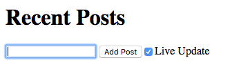
    <figcaption><em>Figure: Serving server-rendered Hyperapp</em></figcaption>
    <br><br>
</figure>

## Fetching data on the server

In this section you'll add a list of posts to your HTML representation. 

Server and client code have different data fetching patterns.
Client-side code usually fetches data in the background. 
For example, ```LoadLatestPosts``` effect starts when you open a browser and data is fetched in the background. 
When the data arrives Hyperapp re-renders a view with a newly fetched response data.

Server-side code has to wait for the data first and only then render the response. So this "wait before render" behavior is a major difference. 

In this tutorial you won't be trying to create universal data fetching effects that can be shared between a client and a server. 
Instead we'll use ```axios``` and handle data in a server specific way.
```
  "dependencies": {
    "axios": "0.19.2",
    "express": "4.17.1",
    "hyperapp-render": "3.2.0"
  },
```
```npm i```

```javascript
import render from "hyperapp-render";
import express from "express";
import {state, view, SetPosts} from "./src/app.js";
import axios from "axios";

const app = express();

app.get("/", async (req, res) => {
    const response = await axios.get("https://hyperapp-api.herokuapp.com/api/post");
    const posts = response.data;
    const stateWithPosts = SetPosts(state, posts);
    const html = render.renderToString(view(stateWithPosts));
    res.send(html);
});
app.listen(3000, () => {
    console.log("Listening on 3000");
});
```
Make sure ```SetPosts``` action is exported and use it in your server-side code. 

Open your app in the browser. A list of posts should be rendered.

<figure>
    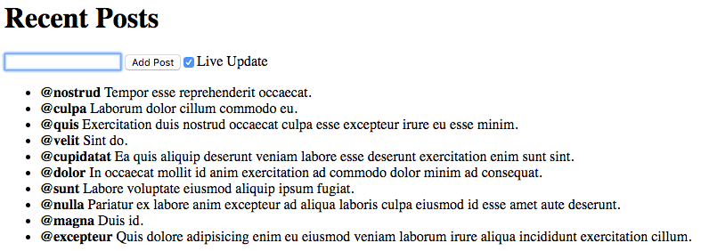
    <figcaption><em>Figure: Serving server-rendered Hyperapp with data</em></figcaption>
    <br><br>
</figure>

To re-iterate what you've just learner: Hyperapp can be used as **a server-side template engine** with a help of ```hyperapp-render```.

## Hydrating server side code on the client side

**Hydration** is a fancy name for taking control over server-side rendered content on the client side. 
For large applications server-side rendering with or without hydration always improves the time to visible content. 
However when it comes to time to interactivity hydration always performs worse than server-side rendering or client side-rendering alone. 
In other words with hydration you pay the rendering tax twice (HTML rendering and JS rendering/hydrating). 
Since Hyperapp is really small you may not even notice the hydration penalty.

Move **src/index.html** content into **Server.js** and put it into a template string:
```javascript
const htmlTemplate = (content) => /* HTML */ `
  <!DOCTYPE html>
  <html lang="en">
    <head>
      <meta charset="UTF-8" />
      <meta name="viewport" content="width=device-width, initial-scale=1" />
      <title>HyperPosts</title>
      <link rel="stylesheet" href="https://andybrewer.github.io/mvp/mvp.css" />
      <script type="module" src="Start.js"></script>
    </head>
    <body>
      <main>
        <div id="app">${content}</div>
      </main>
    </body>
  </html>
`;
```
You'll be replacing ```content``` placeholder with dynamically rendered content.
Note: ```/* HTML */``` comment is for prettier to auto-format the string as HTML.

Update **Server.js**:  
```javascript
app.get("/", async (req, res) => {
  const response = await axios.get(
    "https://hyperapp-api.herokuapp.com/api/post"
  );
  const posts = response.data;
  const stateWithPosts = SetPosts(state, posts);
  const content = render.renderToString(layout(view)(stateWithPosts));
  res.send(htmlTemplate(content));
});
app.use(express.static("src"));
```
Wrap your ```view``` into a ```layout```.
Pass a server generated content into your HTML template.
Serve static files from the **src** directory. 
Put the static handler after GET "/" handler so ```src/index.html``` has lower precedence than our root resource.

Run it:
```
node Server.js
```

Test your posts page with JS enabled and disabled.

## Exercise: server side-rendering and hydration 

Implement server-side rendering and hydration for the login page. Test your app with JS enabled and disabled.

<details>
    <summary id="ssr_and_hydration">Solution</summary>

```javascript
import { state as loginState, view as loginView } from "./src/Login.js";

app.get("/login", async (req, res) => {
  const content = render.renderToString(layout(loginView)(loginState));

  res.send(htmlTemplate(content));
});
```

You can expand on this exercise. Some ideas for further experiments:
* serialize state and pass it from server to client to avoid double fetching initial list of posts
* build shared routing abstraction for the client and the server

</details>

## Preparing code for production

Before you ship your code to production you may need to:
* translate modern ES6+ code to ES5 so older browsers can understand it
* generate a single or a few JS bundles to avoid serving too many files

If you're only targeting modern browsers and serving code over HTTP/2 you may be able to skip those steps.

In this tutorial we use [Parcel](https://parceljs.org/) - a zero-configuration bundler.

```
npm i parcel -D
```

Add a script to build your production code:
```json
  "scripts": {
    "build": "parcel build src/index.html"
  }
```
```npm run build```

Parcel will generate a ```dist``` directory with the production optimized code.

Verify your production distribution locally:
```
http-server dist
```

Current Parcel version (1.x) has a bug causing ```console.error```: ```Uncaught ReferenceError: parcelRequire is not defined```.
It will be fixed in Parcel 2 release.

## Deploying code to Netlify

I'm using [Netlify](https://www.netlify.com/) to host this project. In the following figure you will find my deployment settings:

<figure>
    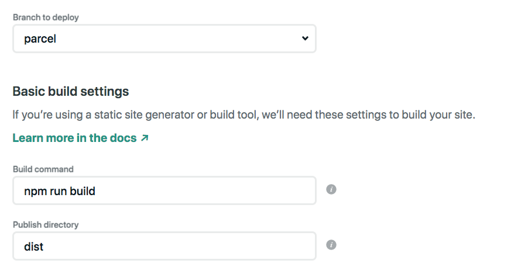
    <figcaption><em>Figure: Netlify deployment settings</em></figcaption>
    <br><br>
</figure>

Once you connect your Github repo configure:
* branch to deploy: I'm using a branch called "parcel". On master I keep a lightweight setup without a bundler.
* build command: ```npm run build``` from the previous step
* publish directory: ```dist``` a default Parcel directory

Every time you push to the branch, Netlify will deploy a new version.

You can find my deployed version here: https://hyperposts.netlify.app/

## Optimizing code size

One of the most underrated performance optimizations is using lighter frameworks and libraries.

Use ```bundlephobia``` to check the size of our dependencies (minified+gzipped):
* https://bundlephobia.com/result?p=hyperapp@2.0.4 (1.9kB)
* https://bundlephobia.com/result?p=hyperapp-fx@2.0.0-beta.1 (1.6kB)
* https://bundlephobia.com/result?p=@hyperapp/events@0.0.4 (0.8kB)
* https://bundlephobia.com/result?p=htm@3.0.4 (0.7kB)
* https://bundlephobia.com/result?p=page@1.11.6 (3.9kB)

To make this comparison relevant here are some of the popular libraries:
* https://bundlephobia.com/result?p=@angular/core@9.1.7 (90kB)
* https://bundlephobia.com/result?p=react-dom@16.13.1 (36kB)
* https://bundlephobia.com/result?p=vue@2.6.11 (22.8kB)

Using Hyperapp is a performance optimization in and of itself.

Check your application bundle size in the browser.

<figure>
    
    <figcaption><em>Figure: Bundle size with minification and Brotli compression</em></figcaption>
    <br><br>
</figure>

With minification and Brotli compression (from Netlify server) the application is only 10kB. 
It easily fits into most [performance budgets](https://web.dev/performance-budgets-101/).

Note: I was using scope hoisting/tree shaking feature of Parcel ```parcel build src/index.html --experimental-scope-hoisting```.
Without this optimization the application was 12kB.

## Summary

You started this tutorial with the elevator pitch:
```
For JS developers. 
Who need to build highly interactive Web interfaces  
Hyperapp is a functional view and state management framework
That allows for writing easy to understand, performant and testable code
Unlike other JS frameworks
Hyperapp fits in one 500 LOC file with zero dependencies and facilitates programming in a tiny subset of JS "the very best parts"
```
To summarize everything you've learned I'd like to expand on the elevator pitch and provide more details.
For me personally Hyperapp has 3 main benefits:
* teachability
* performance
* correctness

### Teacheability

* Tiny size: with some effort I can understand Hyperapp source code without being a core contributor. 
On the other hand, most other frameworks have tens/hundreds of thousands lines of code. I am at the mercy of their documentation and people
finding time to solve my problems. With Hyperapp I just look at the code.
* Tiny API surface area: only 5 core concepts to learn. State, views, actions, effects and subscriptions. The last 4 are just functions.  
* Small subset of JS: pure functions and object literals powered by the Elm-inspired functional architecture. 
No need for this, new, classes. No need to extend from framework components or annotate code with @Component annotations.
Those things are like dandruff for your application code. 
Also, no need for hooks and special linting rules. No need for nonstandard language extensions.
* ESM native: you can use Hyperapp directly in your browser without any extra tooling in development.
* Transferable skills: Hyperapp uses core DOM Events API. The onlick, oninput, event.target.value you learned 10 years ago are still relevant.

### Performance

* Fast load time: with one file and zero dependencies Hyperapp loads fast by default (less than 2 kB). It doesn't require sophisticated performance tricks to load faster.
* No compromise in runtime performance: https://krausest.github.io/js-framework-benchmark/current.html 

### Correctness

* Easy to unit test: everything is a pure function. Pass the input, verify the output. 
* Side effects at the edges: framework executes side effects, your own code is only pure functions.
* Centralized immutable state: easy to track state transitions from the old state to the new state. 


## Comparison to other technologies

You may be wondering how Hyperapp compares to other frontend solutions. Below you'll find my subjective comparison.

My choice of technology is filtered through those principles:
* Understand things from principles. 
* Understand one layer of abstraction below your normal abstraction.
* Compose solutions from simple tools solving narrow problems aka Unix Philosophy.
* Prioritize tools that give you fast feedback (fast build, fast subsecond tests etc.).  

If your principles are different probably you'd make different choices.

### Elm

Type-Driven Development in Elm makes for a very nice and beginner friendly development experience. 
Compiler taking care of runtime exceptions is very helpful.
Refactoring is much easier than in the JS/TS world. The tradeoff is that Elm requires build tools in development. You can't use a browser as your REPL.
Also some APIs that haven't been ported to Elm are harder to work with than in JS. Finally, due to limited support for generics and lack
of higher-kinded types some duplication is necessary. For some people it's a bug, for some others it's a feature.

### React

Because of the code size, I can't understand it at the source code level. It has many parts I don't care about (classes, lifecycle method etc.).

### Preact

Smaller than React. Can read the sources and understand them. Has many parts I don't care about. To emulate functional architecture requires extra libraries.

### Angular

Totally opposite approach to Hyperapp. Layers upon layers of abstraction. Too far away from the browser to my taste. Too OO centric 
and too much magic. Way too big to understand it at the source code level. 

### Vue

Uses language features I tend to avoid (new, classes, this). Too big to understand at the source code level. 

### Svelte

Nice idea with code shrinking at runtime. But it's not really JS, but a compiler from JS superset. If I have to pay the price
of another language with compiler enabling dead code elimination I'd go for Elm.


