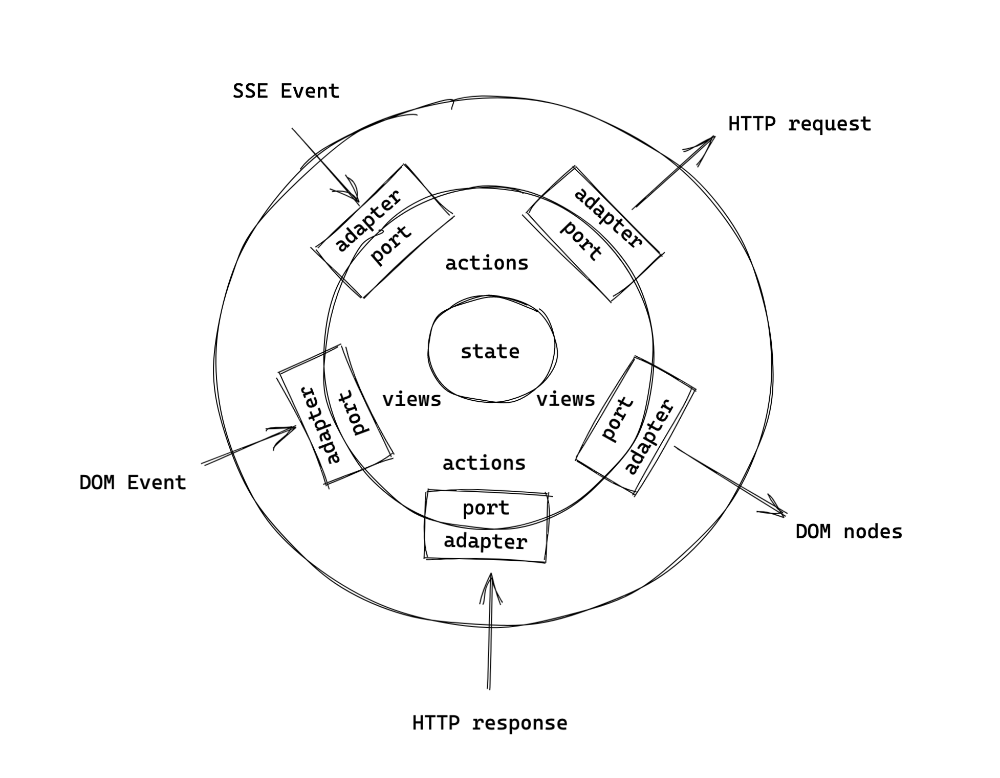

# Chapter 10: Unit testing

## Understanding testable architecture

In the object-oriented programming circles, people often talk about creating testable architecture that goes by different names:
* functional core, imperative shell
* ports and adapters architecture
* and many others (onion, hexagonal, clean etc.)

You can read lengthy books on how to achieve the holy grail of architecture, and usually, much effort is required. 

Functional architecture imposed by Hyperapp makes the holy grail a default. 
As Mark Seemann noted in his [blog](https://blog.ploeh.dk/2016/03/18/functional-architecture-is-ports-and-adapters/) "functional architecture tends to fall into a pit of success".

You can visualize your app as the state in the center. Actions and view declarations are sitting around it. And effects/subscriptions/DOM manipulation at the edges.



Your application is as a **functional core** with pure view functions, pure actions and immutable state.  
The framework is an **imperative shell** sitting at the edges, interpreting effectful actions and handling side-effects.

The functional core makes decisions and defines the shape of your UI, the shell converts the decisions into side effects, gathers the inputs and renders physical DOM nodes.

Your effect interface is a **port** to the external world. 
The actual effect definition invoked by the framework is an **adapter**.

In terms of testability, functional core allows for simple output-based unit testing:
* invoke a function
* assert on the output
* skip the mocks entirely

## Separating framework setup from the application building blocks

To make code easier to test separate the `app` call from the application building blocks: state, view, actions and subscriptions.

**App.js** should setup Hyperapp:
```js
import { app } from "./web_modules/hyperapp.js";
import {init, view, subscriptions} from "./Posts.js";

app({
  init,
  view,
  subscriptions,
  node: document.getElementById("app"),
});
```

**Posts.js** should export application building blocks for **App.js**:
```js
export const view = (state) => html`
    ...
`;

export const subscriptions = (state) => [
    state.liveUpdate &&
    EventSourceListen({
        action: SetPost,
        url: "https://hyperapp-api.herokuapp.com/api/event/post"
    }),
];

export const init = [state, LoadLatestPosts];
```


## Testing simple actions

You will use **mocha** as a test runner and a test reporter.

Why mocha?
* it has **native EcmaScript Modules (ESM) support** so you don't need a transpiler in testing. 
Less tooling is always better. We don't want the test framework to run code through babel if it doesn't need to.
* it **doesn't try to be a mocking framework** encouraging questionable testing practices like overwriting imports for testability. 
Relying on a test framework to mock imports is a dead-end testing strategy. You're not resolving the tight coupling in your code so your code can't be tested in other test runners. We prefer to rethink code structure to make it testable in every test runner. 
* it has fast, clean startup time that allows for **subsecond tests** without watchers. It's difficult to explain why the subsecond test suite is so important without experiencing it first-hand. We can only encourage you to give it a try. You may never want to go back to a typical slow testing setup. It's something to think about every time you run your tests, and you look at your test frameworks doing its setup instead of running your tests. 
* it runs your tests in Node.js and **in a browser**.

Our main reservation about mocha is that it can't run plain Node.js files as tests, but it's a minor nuisance compared to the benefits it provides. 

Make sure you have **Node 14** or higher installed as it ships with native ESM support.

Include those changes in **package.json**:
```json
{
  "type": "module",
  "scripts": {
    "snowpack": "snowpack install --exclude 'test/**' --dest=src/web_modules",
    "test": "mocha test/*Test.js",
    /* keep the rest of scripts */
  },
  "devDependencies": {
    "mocha": "8.0.1",
    /* keep the rest of dependencies */
  }
}

```
This code:
* tells Node.js to use ESM modules (`"type": "module"`)
* prevents snowpack from installing test dependencies
* runs mocha
* adds mocha as a development dependency

Now install mocha by running:
`npm i`

Write your first test in **test/PostsTest.js**:
```js
import assert from "assert";
import { UpdatePostText } from "../src/Posts.js";

describe("Posts:", () => {
  it("post text is updated", () => {
    const initState = {
      currentPostText: "",
      requestStatus: { status: "idle" },
    };

    const newState = UpdatePostText(initState, "text");

    assert.deepStrictEqual(newState, {
      currentPostText: "text",
      requestStatus: { status: "idle" },
    });
  });
});
```
This code uses Node.js built-in `assert` module. 

The test:
1. prepares initial state
2. invokes an action with a new post text
3. verifies expected state changes

You can think of this test as three blocks separated by empty spaces:
1. given
2. when
3. then

Run the test:
`npm test`

The test runner should report that `UpdatePostText` is not exported.

Add the `export` keyword:
```js
export const UpdatePostText = (state, currentPostText) => ({
  ...state,
  currentPostText,
  requestStatus: idle,
});
```

The test should go green. 

Note: We encourage you to get into the habit of seeing a failing test first. If you haven't seen the falling test, you can't be sure if the test even run. It may sound silly, but it happens more often than any experienced programmer would want to admit (ourselves included). 

One of the tradeoffs of actions unit testing is that you need to expose them in the public API of the tested module.

## Exercise: Testing simple actions

Write a unit test verifying `UpdatePostText` resets error request status to idle.

```js
const initState = {
  currentPostText: "",
  requestStatus: {
    status: "error",
    error: "oh nooo"
  },
};
```

<details>
    <summary id="testing_actions">Solution</summary>

```js
  it("post status is reset to idle", () => {
    const initState = {
      currentPostText: "",
      requestStatus: { status: "error", error: "oh nooo" },
    };

    const newState = UpdatePostText(initState, "text");

    assert.deepStrictEqual(newState, {
      currentPostText: "text",
      requestStatus: { status: "idle" },
    });
  });
```

</details>

## Making actions more testable

The `AddPost` action is difficult to unit test because it relies on `Math.random()` for guid generation. 

More testable implementation would take `id` as an input parameter:
```js
const AddPost = (state, id) => {
  // ...
};
```

Find usage of `AddPost` and replace it with:
```js
const addPostButton = ({ status }) => html`
  <button onclick=${WithGuid(AddPost)} disabled=${status === "saving"}>
    Add Post
  </button>
`;
```
`WithGuid` doesn't exist yet. You're only sketching future API in code. It's a similar technique to TDD. 
You let the usage of the API to guide its shape.

`WithGuid` should tell Hyperapp to generate a new id and pass it to a testable action:
```js
const WithGuid = (action) => (state) => [state, Guid(action)];
```
`WithGuid` is a function creating an effectful action. `Guid` itself is an effect. The only difference with the `Http` effect is that you don't need any additional `data` so you're passing action directly. 
```js
const Guid = (action) => [
  (dispatch, action) => {
    dispatch(action, guid());
  },
  action,
];
```
If you have any problems following this code, revisit [Chapter 6: Effects as data](ch6.md)

## Testing effectful action

Test `AddPost` action.
```js
  it("add post", () => {
    const initState = {
      currentPostText: "text",
      requestStatus: { status: "idle" },
      post: [],
    };

    const [newState, [savePostEffect, savePostData]] = AddPost(
      initState,
      "1234"
    );

    assert.deepStrictEqual(newState, {
      currentPostText: "",
      requestStatus: { status: "saving" },
      posts: [],
    });
    assert.deepStrictEqual(
      savePostData.url,
      "https://hyperapp-api.herokuapp.com/api/post"
    );
  });
```
Effectful actions return new state and one or many effects. Destructure the effect to assert on its data conveniently. 

`AddPost`:
* should clear the `currentPostText`
* should mark the request as `saving`
* should not add any posts to the `posts` list yet

Ignore the `savePostEffect` as it's only for the framework. 
However, you can verify if the `savePostData` effect got correct data. In this case, check the `url`. 

To emphasize that you don't verify the effect definition, name it with `_` or leave a blank in the destructured array.
```js
const [newState, [_, savePostData]] = AddPost(initState, "1234");
const [newState, [, savePostData]] = AddPost(initState, "1234");
```

Run the test and check if it's green. It should be red. You will need to export the `AddPost` action.

## Separating the application code from the library code

Before you start testing effects and subscriptions separate them from the rest of the code.
Create **src/lib** directory and move SSE and guid related code there. Remember to export appropriate functions.

**src/lib/EventSource.js**
```js
const eventSourceSubscription = (dispatch, data) => {
  const es = new EventSource(data.url);
  const listener = (event) => dispatch(data.action, event);
  es.addEventListener("message", listener);

  return () => {
    es.removeEventListener("message", listener);
    es.close();
  };
};
export const EventSourceListen = (data) => [eventSourceSubscription, data];
```

**src/lib/Guid.js**
```js
const guid = () => {
  return "xxxxxxxx-xxxx-4xxx-yxxx-xxxxxxxxxxxx".replace(/[xy]/g, function (c) {
    var r = (Math.random() * 16) | 0,
      v = c == "x" ? r : (r & 0x3) | 0x8;
    return v.toString(16);
  });
};
const Guid = (action) => [
  (dispatch, action) => {
    dispatch(action, guid());
  },
  action,
];

export const WithGuid = (action) => (state) => [state, Guid(action)];
```

In **Posts.js** you should have those imports:
```js
import { EventSourceListen } from "./lib/EventSource.js";
import { WithGuid } from "./lib/Guid.js";
```

## Advanced: Testing effects and subscriptions

Effects and subscriptions live at the edges of the system and interact with browser APIs outside of your control, e.g. DOM API or Fetch API. 
Therefore, effects and subscriptions are more difficult to unit test. It's usually a job of the effect library author.

Create **test/EventSourceTest.js**:
```js
import assert from "assert";
import { EventSourceListen } from "../src/lib/EventSource.js";

const givenEventSource = (serverUrl) => {
  const listeners = {};
  let isClosed = false;
  const es = {
    addEventListener(name, listener) {
      listeners[name] = listener;
    },
    removeEventListener(name, listener) {
      delete listeners[name];
    },
    close() {
      isClosed = true;
    },
  };
  const emit = (event) => {
    Object.values(listeners).forEach((listener) => {
      listener(event);
    });
  };

  function EventSource(url) {
    if (url === serverUrl) return es;
  }
  global.EventSource = EventSource;
  
  return { emit, isClosed: () => isClosed };
};

const runFx = ([effect, data]) => {
  const dispatch = (action, event) => (dispatch.invokedWith = [action, event]);
  const unsubscribe = effect(dispatch, data);
  return { dispatch, unsubscribe };
};

describe("Event source subscription", () => {
  const defaultEventSource = global.EventSource;
  afterEach(() => {
    global.EventSource = defaultEventSource;
  });

  it("dispatches events", () => {
    const { emit } = givenEventSource("http://example.com");
    const { dispatch } = runFx(
      EventSourceListen({ url: "http://example.com", action: "action" })
    );

    emit({ data: "event data" });

    assert.deepStrictEqual(dispatch.invokedWith, [
      "action",
      { data: "event data" },
    ]);
  });
});
```
Take your time to scan the test visually.

`givenEventSource` simulates SSE server emitting events (the `emit` function) and client-side API reacting to those events (the `es` object).
The `es` object is a handwritten test double handling selected parts of the EventSource API.
`runFx`  simulates Hyperapp setting up a subscription and exposes a`dispatch` mock function.
`dispatch.invokedWith` is a convention to record interaction without using a mocking framework.

In the test body `emit` a fake server event. Next, verify if the `dispatch` function was invoked with the event.
After the test runs (in `afterEach`) revert the original `EventSource` in the global namespace (if there was one). 

The code and tests for effects/subscriptions are conceptually more complicated than the rest of the code. It's the inherent complexity of the Web platform. Because this code is not very convenient to work with Hyperapp keeps it at the edges and doesn't allow your application code to get polluted. 
All those callback event listeners and eagerly resolving promises (e.g. `fetch`) are hidden away from your application logic.

## Exercise: Testing effects and subscriptions

Write a second test that verifies if emitting an event after `unsubscribe` triggers no `dispatch` calls.
Additionally, verify if the connection was closed.

<details>
    <summary id="testing_effects">Solution</summary>

```js
  it("ignores events emitted after unsubscribe", () => {
    const { emit, isClosed } = givenEventSource("http://example.com");
    const { dispatch, unsubscribe } = runFx(
      EventSourceListen({ url: "http://example.com", action: "action" })
    );
    unsubscribe();

    emit({ data: "event data" });

    assert.deepStrictEqual(dispatch.invokedWith, undefined);
    assert.ok(isClosed());
  });
```
</details>