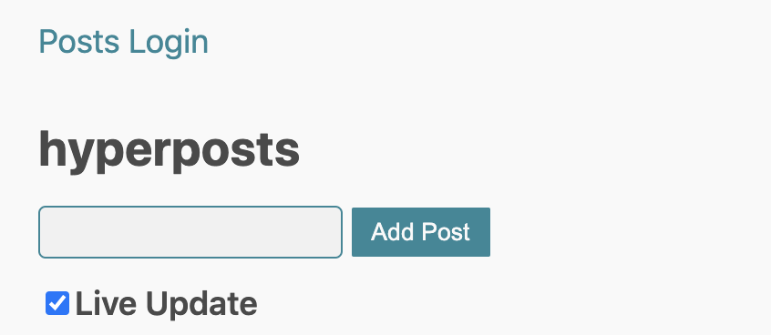
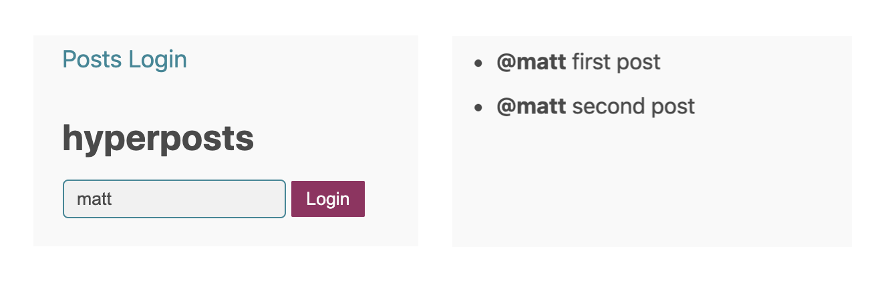

# Chapter 12: Server-side routing

## Analyzing routing options

In the next few sections, you'll start adding a login page. With more than a single page, our system requires routing.
There are two routing options:
* server-side
* client-side

With **server-side** routing, you create one app per page. Each page:
* can evolve independently
* can use a different version of the framework
* can even use a different framework
* can use only HTML/CSS when JS is not needed
* can use natural code splitting without any tools

You integrate pages with hypermedia: links and forms. 
To read more about this architecture, go to the **Self-Contained Systems** [website](https://scs-architecture.org/).

With **client-side** routing, you manage page transitions in JS, and you need a client-side router. 
Most JS routers:
* hijack links and forms to prevent the default browser behavior
* call `history.pushState` to update URL bar
* listen to `popstate` events to make the back and forward buttons work

Unfortunately, if you're only doing client-side routing, you end up with long load and parsing of your JS files. Loading code for all routes is a waste of user's bandwidth and time. You can use code-splitting to load and parse only the code for the current page. Unfortunately, it's not free. You need a complicated build tool like webpack, and worse, you have to sprinkle your whole application with loading of async chunks.

We will focus on server-side routing in the next sections to show you it's advantages. We will cover client-side routing in the next chapter.

## Extracting htm binding

Before you build a new page, extract code for binding `htm` to `h`.

Create **src/Html.js**:
```js
import { h } from "./web_modules/hyperapp.js";
import htm from "./web_modules/htm.js";

export const html = htm.bind(h);
```

Use the `html` template literal in **src/Posts.js**:
```js
import { app, Lazy } from "./web_modules/hyperapp.js";
import {html} from "./Html.js";

// delete htm binding
// const html = htm.bind(h);
```

## Decorating view with layout and navigation

In this section, you'll add a global layout function with shared navigation.

First write our ideal signature for the layout decorator in **src/App.js**:
```js
  app({
    view: layout(view),
  });
```
`layout` should wrap the original `view` function and return a new function with a state parameter.

Create **src/Layout.js** with a function matching this specification.
```js
export const layout = (view) => (state) => html`…`;
```

Fill in the gaps:
```js
import { html } from "./Html.js";

const nav = html`
  <nav>
    <ul>
      <li><a href="/" class="href">Posts</a></li>
      <li><a href="/login" class="href">Login</a></li>
    </ul>
  </nav>
`;

export const layout = (view) => (state) => html`
  <div>
    <header>
      <h1>HyperPosts</h1>
      ${nav}
    </header>
    <main>
      ${view(state)}
    </main>
  </div>
`;

```
`layout` provides a common header with two navigation links.
Then it delegates the main content rendering to the `view` function. 


Import the layout in **src/App.js** and test your app:
```js
import { layout } from "./Layout.js";
```



## Routing between HTML pages

To explore server-side routing, create a second HTML page **src/login.html**.

```html
<!DOCTYPE html>
<html lang="en">
<head>
    <meta charset="UTF-8">
    <meta name="viewport" content="width=device-width, initial-scale=1" />
    <title>HyperPosts</title>
    <link rel="stylesheet" href="https://andybrewer.github.io/mvp/mvp.css">
    <script type="module" src="Login.js"></script>
</head>
<body>
<main>
    <div id="app"></div>
</main>
</body>
</html>
```
This is almost the same HTML you wrote for the main page. The only difference is a JS file name.

Create **src/Login.js**:
```js
import { app } from "./web_modules/hyperapp.js";
import { layout } from "./Layout.js";
import { html } from "./Html.js";
import { WriteToStorage } from "./web_modules/hyperapp-fx.js";

const state = {
  username: "",
};

const targetValue = (event) => event.target.value;

const ChangeLogin = (state, username) => [
  { ...state, username },
  WriteToStorage({ key: "hyperposts", value: username }),
];

const view = (state) => html`
  <form method="get" action="/">
    <input oninput=${[ChangeLogin, targetValue]} value=${state.username} />
    <button>Login</button>
  </form>
`;

app({
  init: [state],
  view: layout(view),
  node: document.getElementById("app"),
});
```
This is another Hyperapp application. 
In this book, we use the same Hyperapp version for login and posts. However, having two separate pages allows us to evolve the framework versions independently. You don't have to upgrade all your pages at once.

The code for the login page should look familiar by now. 
The only new thing is the `WriteToStorage` effect from the hyperapp-fx library. 
As the user types her username, we save it to the localStorage. 

`WriteToStorage({key: "hyperposts", value: login})` basically translates to `localStorage.setItem("hyperposts", JSON.stringify(login))`.


When the user clicks the **Login** button, a regular HTML form should take her to the main page.
Navigation is handled by the browser talking to the HTTP server. No JS is involved. 
It turns out browsers are really good at handling hypermedia.
You only have to make sure that JS doesn't hijack the form submission. 

When you run the app make sure only to serve the **src** directory: `http-server src`
 

## Exercise: reading from local storage

Read the login username and set it on the posts page. 
When the user submits a new post, use her actual username instead of "anonymous".



To make it easier here's a starter code for reading from storage:
```js
import {ReadFromStorage} from "./web_modules/hyperapp-fx.js";

const ReadLogin = ReadFromStorage({key: "hyperposts", action: ({value}) => ...})
```

<details>
    <summary id="reading_local_storage">Solution</summary>

```js
import { ReadFromStorage } from "./web_modules/hyperapp-fx.js";

export const state = {
  ...
  username: "anonymous",
};

export const AddPost = (state, id) => {
  ...
    const newPost = {
      id,
      username: state.username,
      body: state.currentPostText,
    };
  ...  
};

const SetUsername = (state, { value }) =>
  value ? { ...state, username: value } : state;

const ReadUsername = ReadFromStorage({
  key: "hyperposts",
  action: SetUsername,
});

export const init = [state, [LoadLatestPosts, ReadUsername]];
```

</details>

## Exercise: testing logged in user posts submission

Write an integration test for a logged-in user posting with her username.

Hints:
* use `randomMessage`, `sendMessage`, and `waitForMessage` helpers functions you already have in **App.test.js**
* remove logged-in user from `localStorage` before each test
* simulate logged-in user with this code `localStorage.setItem("hyperposts", JSON.stringify("kate"));`

<details>
    <summary id="logged_in_posts">Solution</summary>

```js
  beforeEach(function () {
    container().innerHTML = "";
    localStorage.removeItem("hyperposts");
  });

  it("Add a post as logged in user", async () => {
    localStorage.setItem("hyperposts", JSON.stringify("kate"));
    start();
    const newMessage = randomMessage();

    await sendMessage(newMessage);

    await waitForMessage(`@kate ${newMessage}`);
  });
```

</details>

## Exercise: displaying username in the header

In this exercise, you'll see the benefits of having a single application state.
Display current username in the application header as shown in the following figure:


<details>
    <summary id="displaying_username_in_header">Solution</summary>

**Layout.js**
```js
export const layout = (view) => (state) => html`
  <div>
    <header>
      <h1>@${state.username} HyperPosts</h1>
      ${nav}
    </header>
    <main>
      ${view(state)}
    </main>
  </div>
`;
```

The single application state approach also shines when you need to persist your entire state to localStorage or some remote API.

</details>