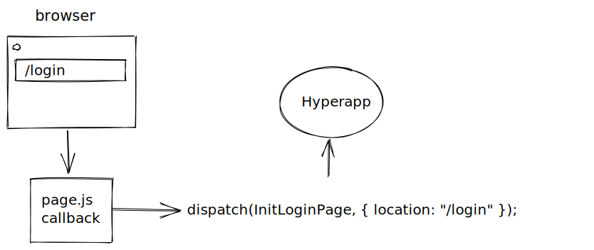

# Chapter 13: Client-side routing and 3rd party integration

## Preparing for client-side routing

Server-side routing is easier than client-side routing. 
You let the browser handle links, forms, history, back, and forward buttons. 
However, in specific situations, you need to take over the browser's job and handle routing in JS. 
It results in the increased complexity of your application state and subscriptions.
With client-side routing, you need to track a current page (in your state object) and react to navigation events (in a subscription).
 
First, expose the init action for each of your pages:

**src/Posts.js**
```js
export const InitPage = (_, {location}) => [
  { location, ...state },
  LoadLatestPosts, 
  ReadUsername
];
```
The router will invoke this action when a user navigates to the page.
You expose a way for the router to inject a location into the current page state.
We copy the state from the initial state object. We ignore the previous state (`_`) since we can fetch the username from the `ReadUsername` effect.

Now go to **src/Login.js**:
```js
export const InitPage = (state, { location }) => ({
  location,
  username: state.username
});
```
This page doesn't trigger any effects on init. It also reads the state from the previous page, without going to the local storage or to the server.
The ability to share state between pages is one of the selling-points of client-side routing.

Make sure to remove the `app()` call. You'll be moving towards one centralized app set up in the next section.

Finally, export the `view` function from **Login.js**:
```js
export const view = (state) => html`
  …
`;
```

## Setting up the main app

Setup you Single-Page Application in **App.js**:
```js
import { app } from "hyperapp";
import {
  view as postsView,
  subscriptions,
} from "./Posts.js";
import { view as loginView } from "./Login.js";
import { layout } from "./Layout.js";

const pages = {
  "/": postsView,
  "/login": loginView,
};
const view = (state) => {
  const page = pages[state.location];
  return page ? page(state) : "Page not found.";
};

export const App = () =>
  app({
    init: {},
    view: layout(view),
    subscriptions,
    node: document.getElementById("app"),
  });
```
You start by mapping each path to the corresponding page view.
The main `view` function selects a page based on `state.location` that you'll set in the next section.
The `init` is an empty object for now. You'll invoke page init actions from the router.

## Integrating with 3rd party libraries

This section will integrate your code with a client-side router [page.js](https://github.com/visionmedia/page.js/). 
Even though you can use a dedicated Hyperapp router (WIP @hyperapp/navigation), the section is still relevant.
We use it to show how Hyperapp can work with any library outside of its ecosystem. 

Add page.js to `package.json`:
```json
  "dependencies": {
    "hyperapp": "2.0.14",
    "hyperapp-fx": "2.0.0-beta.2",
    "hyperlit": "0.3.6",
    "page": "1.11.6"
  },
```

Looking at page.js documentation, we came up with the following API calls in **src/lib/Router.js**:
```js
import page from "page";

page("/", fn); // register a route and call fn when a user navigates to the url
page("/login", fn);

page.start(); // start client-side routing
page.stop(); // stop client-side routing
```

page.js is our biggest dependency so far, but it's still under reasonable 10kB after gzip or brotli compression.
Minification will bring it down even further.
When choosing libraries err on the side of minimalism and try to avoid huge ones.
Prefer smaller packages that follow the [Unix philosophy](https://homepage.cs.uri.edu/~thenry/resources/unix_art/ch01s06.html) and are easy to compose. 
Unfortunately, few library authors dare to say "no, it doesn't belong in my library".

When wrapping 3rd party libraries, you normally put them inside subscriptions or effects.

Wrap page.js in a subscription:
```js
import page from "page";

const routeSubscription = (dispatch, data) => {
    page("/", () => {

    });
    page("/login", () => {

    });

    page.start();

    return () => {
        page.stop();
    };
};
```
Start the router when the subscription is created. Stop the router when you unsubscribe from it.

## Mapping 3rd party calls to Hyperapp actions

Add URL change handlers calling `dispatch`.
```js
import page from "page";
import { InitPage as InitLoginPage } from "./Login.js";
import { InitPage as InitPostsPage } from "./Posts.js";

const routeSubscription = (dispatch, data) => {
  page("/", () => {
    dispatch(InitPostsPage, { location: "/" });
  });
  page("/login", () => {
    dispatch(InitLoginPage, { location: "/login" });
  });

  page.start();

  return () => {
    page.stop();
  };
};
```
When a user navigates to a new page, call the init action with a current location.
This code depends on application-specific actions and can be more generic. That's what you'll do in the next section.



## Driving router design from the outside

Start from **App.js** where you'll use the router.
```js
import { app } from "hyperapp";
import {
  InitPage as InitPosts,
  view as postsView,
  subscriptions,
} from "./Posts.js";
import { InitPage as InitLogin, view as loginView } from "./Login.js";
import { layout } from "./Layout.js";
import { RouteListen } from "./lib/Router.js";

const pages = {
  "/": postsView,
  "/login": loginView,
};
const pageInitActions = {
  "/": InitPosts,
  "/login": InitLogin,
};
const view = (state) => {
  const page = pages[state.location];
  return page ? page(state) : "Page not found.";
};

export const App = () =>
  app({
    init: {},
    view: layout(view),
    subscriptions: (state) => [...subscriptions(state), RouteListen(pageInitActions)],
    node: document.getElementById("app"),
  });
```
Our hypothetical `RouteListen` subscription should be configured with `pageInitActions` to invoke on page transitions.

Now instead of hardcoding routes (location and init actions) in **Router.js**, we're passing them as `data`. Thanks to that you can create more general **Router.js** implementation:
```js
import page from "page";

const routeSubscription = (dispatch, data) => {
  Object.entries(data).map(([location, init]) => {
    page(location, () => {
      setTimeout(() => {
        dispatch(init, { location });
      }, 0);
    });
  });

  page.start();

  return () => {
    page.stop();
  };
};

export const RouteListen = (data) => [routeSubscription, data];
```
`RouteListen` is parametrized with `data`, in this case we'll be passing `pageInitActions` as `data`. Just to remind you:
```js
const pageInitActions = {
 "/": InitPosts,
 "/login": InitLogin,
};
```
In the subscription definition `routeSubscription`, you iterate over the config `data` object and register a handler for each of the pages. 
Surprisingly, you need to wrap a dispatch call in `setTimeout`. 
Current Hyperapp implementation expects asynchronous calls to dispatch. Otherwise, it goes into the infinite loop. 
This behavior may change in future versions. 

Test the navigation between our two pages. All anchor tags should be handled client-side. 
page.js hijacks browser links, so you don't need to create a custom link element. 
However, when you submit your login, a full-page reload happens. 
page.js doesn't handle forms, only links.
Therefore, you need to create a custom action for the form submission. You'll do this next.

## Wrapping 3rd party library into effects

You can wrap 3rd party libraries not only into subscriptions but also into one-off effects and effectful actions.

Add the `Location` effect to **Router.js**:
```js
const locationEffect = (dispatch, location) => {
  page(location);
};
export const Location = (data) => [locationEffect, data]
```
The effect is not calling dispatch, but invokes our 3rd party library with `page(location)`.
Since we're subscribed to page.js changes, the overall effect is the same - the URL is updated.

Use the effect in **Login.js**:
```js
import {Location} from "./lib/Router.js";

export const Navigate = (location) => (state) => [
  state,
  Location(location),
];

export const view = (state) => html`
  <form method="get" action="/" onsubmit=${Navigate("/")}>
    ...
  </form>
`;
```

If you test the code, it still performs a full page reload. 
In the next section, you'll prevent the default browser submit event to fix this problem.

## Preventing browser events

Add a little helper function in **lib/DomEvents.js**:
```js
export const preventDefault = (action) => (state, event) => [
  state,
  [
    (dispatch) => {
      event.preventDefault();
      dispatch(action);
    },
  ],
];
```
It's a higher-order function to wrap any action in default event prevention capability. `event.preventDefault()` is invoked
before we dispatch the original action. 

Use it in **Login.js**
```js
import { preventDefault } from "./lib/DomEvents.js";

export const view = (state) => html`
  <form method="get" action="/" onsubmit=${preventDefault(Navigate("/"))}>
    ...
  </form>
`;
```
`preventDefault` decorates any event-based action. The wrapping action calls `event.preventDefault()` 
and delegates everything else to the original action.

Now your client-side navigation should work without reloading.