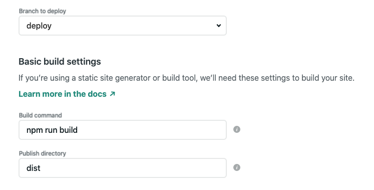
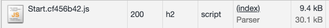

# Hyperapp: functional programming in your browser with 500 lines of code
# Chapter 15: Production

## Preparing code for production

Before you ship your code to production you may need to:
* translate modern ES6+ code to ES5 so older browsers can understand it
* generate a single or a few JS bundles to avoid serving too many files

If you're only targeting modern browsers and serving code over HTTP/2 you may be able to skip those steps.

In this book we use [Parcel](https://parceljs.org/) - a zero-configuration bundler.

```
npm i parcel -D
```

Add a script to build your production code:
```json
  "scripts": {
    "build": "parcel build src/index.html"
  }
```
```npm run build```

Parcel will generate a ```dist``` directory with the production optimized code.

Verify your production distribution locally:
```
http-server dist
```

Current Parcel version (1.x) has a bug causing ```console.error```: ```Uncaught ReferenceError: parcelRequire is not defined```.
It will be fixed in Parcel 2 release.

## Deploying code to Netlify

I'm using [Netlify](https://www.netlify.com/) to host this project. In the following figure you will find my deployment settings:



Once you connect your Github repo configure:
* branch to deploy: I'm using a branch called "parcel". On master I keep a lightweight setup without a bundler.
* build command: ```npm run build``` from the previous step
* publish directory: ```dist``` a default Parcel directory

Every time you push to the branch, Netlify will deploy a new version.

You can find my deployed version here: https://hyperposts.netlify.app/

## Optimizing code size

One of the most underrated performance optimizations is using lighter frameworks and libraries.

Use ```bundlephobia``` to check the size of our dependencies (minified+gzipped):
* https://bundlephobia.com/result?p=hyperapp@2.0.4 (1.9kB)
* https://bundlephobia.com/result?p=hyperapp-fx@2.0.0-beta.1 (1.6kB)
* https://bundlephobia.com/result?p=@hyperapp/events@0.0.4 (0.8kB)
* https://bundlephobia.com/result?p=htm@3.0.4 (0.7kB)
* https://bundlephobia.com/result?p=page@1.11.6 (3.9kB)

To make this comparison relevant here are some of the popular libraries:
* https://bundlephobia.com/result?p=@angular/core@9.1.7 (90kB)
* https://bundlephobia.com/result?p=react-dom@16.13.1 (36kB)
* https://bundlephobia.com/result?p=vue@2.6.11 (22.8kB)

Using Hyperapp is a performance optimization in and of itself. In other words, with Hyperapp
you're paying a much much lower performance tax than in Angular, React or Vue. 
No matter how many performance optimizations you apply to them they will never match load time performance
of unoptimized Hyperapp. And that's what we call a performance [pit of success](https://blog.codinghorror.com/falling-into-the-pit-of-success/).
Or a negligible performance tax. 
The received wisdom that you need to choose between developer experience and load time performance becomes a false dichotomy. 
No matter what performance metric you choose be it [FCP](https://web.dev/first-contentful-paint/), [LCP](https://web.dev/lcp/), [TTI](https://web.dev/interactive/), [FID](https://web.dev/fid/), [TBT](https://web.dev/tbt/) 
you'll be fine. Even if you're scratching your head thinking WTF are those.

Check your application bundle size in the browser.



With minification and Brotli compression (from the Netlify server) the application is only 10kB. 
It easily fits into most real-world [performance budgets](https://web.dev/performance-budgets-101/). What it means in practice is
that Hyperapp is a great tool when you need to build apps for the network and CPU constrained devices, without 
sacrificing developer experience.

Note: I was using scope hoisting/tree shaking feature of Parcel ```parcel build src/index.html --experimental-scope-hoisting```.
Without this optimization the application was 12kB.

