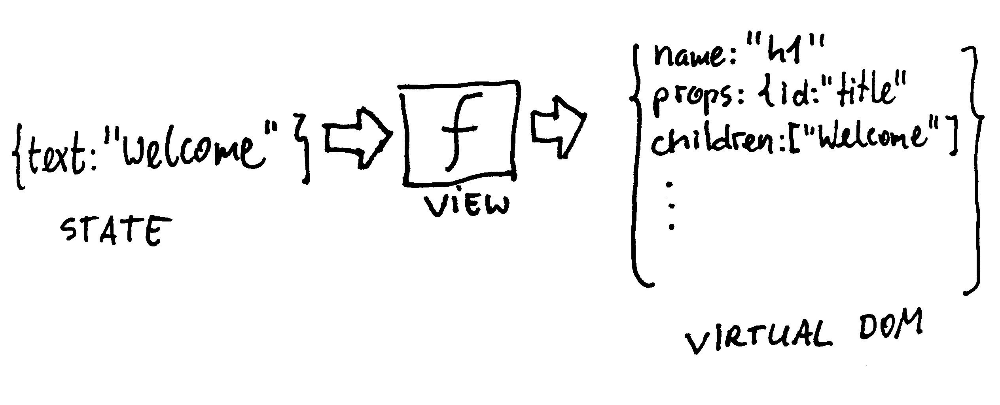

# Chapter 2: View as a function of state

## Getting started

When learning a new framework I like to understand every single step I take and every single line of code I write. 
Therefore, instead of generating boilerplate, you'll be writing everything yourself. 

With more Hyperapp experience, you may formalize the setup into your own starter kit. 
However, you may also realize the starter kit is no longer necessary with certain sources of complexity eliminated.

Create empty **src** directory with **index.html** and **App.js**. This book follows a convention with 
first uppercase letter in JS file names. 

**index.html**
```html
<!DOCTYPE html>
<html lang="en">
<head>
    <meta charset="UTF-8">
    <meta name="viewport" content="width=device-width, initial-scale=1" />
    <title>HyperPosts</title>
    <link rel="stylesheet" href="https://andybrewer.github.io/mvp/mvp.css">
    <script type="module" src="App.js"></script>
</head>
<body>
    <main>
        <div id="app"></div>
    </main>
</body>
</html>
```
You'll be using a prototype friendly [mvp.css](https://andybrewer.github.io/mvp/) stylesheet to get
out-of-the box styling for semantic HTML. 
Our HTML links to **App.js** as ES6 module (```type="module"```), therefore you can use ES6 imports in your JS code. 
Finally, Hyperapp will render its contents into ```<div id="app"></main>```. 


**App.js**
```js
import {h, app} from "https://unpkg.com/hyperapp?module";

const state = {text: "Welcome to Hyperapp!"};

app({
    init: state,
    view: state => h("h1", {id: "my-header"}, state.text),
    node: document.getElementById("app")
});
```
To start experimenting, import Hyperapp as ES6 module directly from CDN (e.g. unpkg.com). 
The exported module provides two functions: ```h``` and ```app```.

The **app** function is your main integration point with the framework. 
Pass an object with 3 parameters:
* **init** - initial state of your application
* **view** - view function rendering current state
* **node** - DOM node to mount the application to

Serve your **src** directory with any static HTTP server. I'm using https://www.npmjs.com/package/http-server 
```
npm i http-server -G
http-server src
```

By default ```http-server``` starts on http://127.0.0.1:8080

Check if you browser renders the following HTML:


## Understanding view function



In the functional approach to UI development, view is a pure function of state. 
Hyperapp ```view``` function takes ```state``` object as an input and returns a data structure describing future DOM tree to build. 
The returned data structure is known as the **Virtual DOM**. The framework can translate it into very efficient low-level DOM updates. 
With Hyperapp you never work directly with the DOM API in your application code. 
Instead of making imperative calls such as ```document.createElement```, ```element.insertBefore``` or ```element.removeChild``` you declare
what the view should look like and let the framework figure out the details.  

## Analyzing view rendering options

View function needs to build a Virtual DOM data structure. You have at least 3 options to choose from:
* ```h```
* ```JSX``` translating to ```h``` at build time
* ```htm``` translating to ```h``` at runtime or build time


### h

Currently your application uses built-in **h** function to create Virtual DOM nodes.
Change your ```view``` function to wrap the text in a ```span``` element:
```js
state => h("h1", {id: "my-header"}, [h("span", {}, state.text)])
```
Check the generated HTML:
```html
<h1 id="my-header"><span>Welcome to Hyperapp!</span></h1>
```

What about creating something more complicated? 
How much effort would it take to translate the following snippet into the ```h``` function calls?
```html
<div>
    <h1>Recent Posts</h1>
    <ul>
        <li>
            <strong>@js_developers</strong>
            <span>Modern JS frameworks are too complicated</span>
        </li>
        <li>
            <strong>@jorgebucaran</strong>
            <span>There, I fixed it for you!</span>
        </li>
    </ul>
</div>
```
Translating between HTML and the ```h``` function calls can get tiresome for nested HTML. 
Even if you automate the process, you still have to mentally switch between JS representation and HTML representation you see in DevTools.
However, if you write everything from scratch and prefer JS-driven templating, calling ```h``` function directly is a solid option. 

### JSX 

[JSX](http://facebook.github.io/jsx/) is a language extension that originated in the React circles. It allows to write JS code that looks like HTML:
```jsx
view: state => <h1 id="my-header"><span>{state.text}</span></h1>
```

To make JSX work, you need to run a transpiler from JSX to the ```h``` function calls. 
If adding a build step to your development process is not your thing, we have one more option.

Note: Hyperapp is dropping support for ```JSX``` soon. 

### htm

[htm](https://github.com/developit/htm) is a tiny library with HTML-like syntax and no build tool requirement. 

Change you **App.js** code to use ```htm```:
```js
import {h, app} from "https://unpkg.com/hyperapp?module";
import htm from 'https://unpkg.com/htm?module';

const html = htm.bind(h);

const state = {text: "Welcome to Hyperapp!"};

app({
    init: state,
    view: state => html`<h1 id="my-header"><span>${state.text}</span></h1>`,
    node: document.getElementById("app")
});
```
```htm``` connects to Hyperapp via ```bind``` function. Write your HTML inside ```html``` tagged template. Under the hood ```htm``` translates everything to the low-level ```h``` function calls.

```htm``` works with any Virtual DOM framework matching the signature:
```js
function buildVirtualNode(type, props, ...children) {}
```
```h``` function happens to match the signature.

Note: If you want to replace ```htm``` with ```h``` calls in production, you can use ```babel-plugin-htm```.