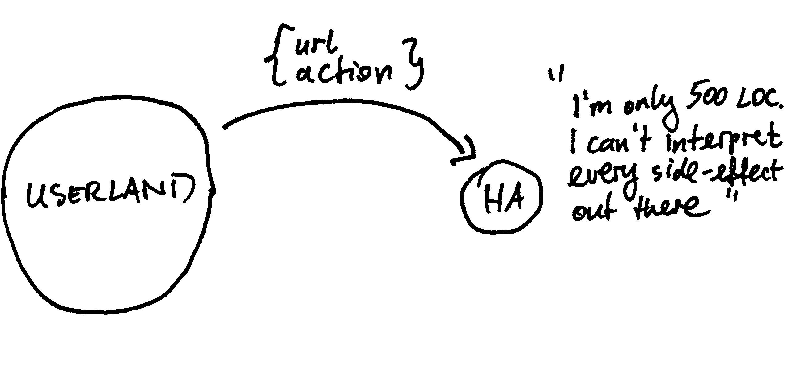
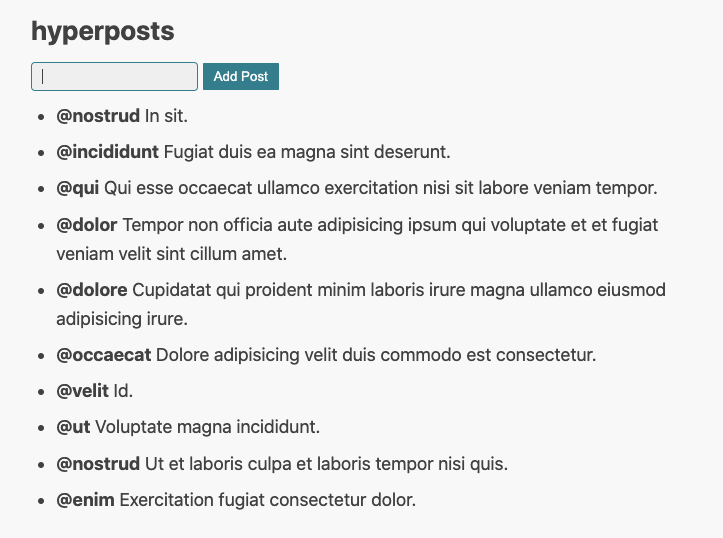
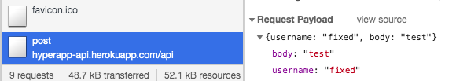

# Chapter 6: Effects as data

## Understanding "effects as data"

All actions you've seen so far were simple state transitions from one data structure to the other. 
However in real-world scenarios your application will probably have to deal with side effect e.g. making HTTP calls to some API. 
A common functional approach to side-effects is to move them to the edges of the system. 

Imagine the following hypothetical code you could write:
```js
const SetPosts = (state, posts) => ({
  ...state,
  posts
});
const LoadLatestPosts = (state) => fetch("https://hyperapp-api.herokuapp.com/api/post").then(SetPosts);
```
```LoadLatestPosts``` uses browser Fetch API to get data from the server. 
When the data arrives it invokes simple state transition function to set the posts in a local state. 
Since ```fetch``` causes side effects (going over the wire with HTTP) it makes your entire program side-effectful. 
It only takes one innocent ```fetch``` call to make the code impure.

Another thought experiment is to represent the effect as a data structure:
```js
const SetPosts = (state, posts) => ({
  ...state,
  posts
});
const LoadLatestPosts = {
  url: "https://hyperapp-api.herokuapp.com/api/post",
  action: SetPosts
};
```
```LoadLatesPosts``` is an object with API ```url``` and follow-up ```action``` to invoke after the fetch completes. 
Ideally we'd like to pass this object to Hyperapp and let it get the posts from the API on our behalf. 
We don't want to fetch the data ourselves in the userland code. 
This is the essence of moving impure code to the edges of the system. Framework handles the impure part, while your code stays pure and very declarative. 

But how should Hyperapp know how to interpret this object? 



There's no way it can possibly translate arbitrary JS objects to every single side-effect you can imagine. 
That's why it doesn't even try. Instead, you must pass side-effect definition and the effect data as a two-argument array.

```js
const LoadLatestPosts = [effectDefinition, {
  url: "https://hyperapp-api.herokuapp.com/api/post",
  action: SetPosts
}];
```

Side-effects in Hyperapp are made of the effect definition and the effect data:
```js
[effectDefinition, data]
```

The effect definition will hide the ```fetch``` call or some other impure API, but you will never invoke it in the userland code.
It's something you must return to the framework, so it can handle the impure part.


## Implementing "effects as data"

In this section you'll use an open source library [hyperapp-fx](https://github.com/okwolf/hyperapp-fx) that implements the most common effects. 
In one of the next sections you'll peek under the hood and build your own effects.

In **App.js** add ```LoadLatestPosts``` effect that invokes ```SetPost``` action on successful response:
```js
import { Http } from "./web_modules/hyperapp-fx.js";

const SetPosts = (state, posts) => ({
  ...state,
  posts
});

const LoadLatestPosts = Http({
  url: "https://hyperapp-api.herokuapp.com/api/post",
  action: SetPosts
});
```
```Http``` function takes your effect data and builds a two-argument array with ```[httpEffectDefinition, effectData]```.

Add ```hyperapp-fx``` and let Snowpack bundle it for the browser:
```
{
  "dependencies": {
    "htm": "3.0.4",
    "hyperapp": "2.0.4",
    "hyperapp-fx": "2.0.0-beta.1"
  }
}
```

```npm i```

## Triggering effects on application startup

With HTTP effect defined you must decide when to invoke it. For now, you'll do it on application startup to start fetching posts early.

Modify ```init``` to invoke ```LoadLatestPosts```:
```js
app({
  init: [state, LoadLatestPosts],
  ...  
});
```
```init``` has overloaded signature. In addition to the initial state you can pass one or more actions to invoke on startup.

With those changes in place test your application. A list of posts from the server should arrive and replace the hardcoded posts. 
You may observe a content flip as Hyperapp replaces initial state with the server posts.



If everything works fine, replace the initial posts with an empty array:
```js
const state = {
  currentPostText: "",
  posts: []
};
```
It will remove the initial flip.

## Writing your own effects

Most of the time you don't need to write your own effects. However, to better understand the underlying concepts implement
```Http``` effect yourself.

Comment out this line of code:
```js
// import { Http } from "./web_modules/hyperapp-fx.js";
```

Your own implementation of the effect should build an array with the effect definition and the effect data.
```js
const Http = data => [httpEffect, data];
```
Hyperapp expects two-parameter signature in the effect definition:
```js
const httpEffect = (dispatch, data) => {};
```

A simple implementation of the HTTP effect may look like this:
```js
const httpEffect = (dispatch, data) => {
  return fetch(data.url)
      .then(response => response.json())
      .then(json => dispatch(data.action, json));
};
```
As an effect library author you translate the side-effectful API call (e.g. ```fetch```) into a ```dispatch``` call.  
Hyperapp will invoke this effect and inject a ```dispatch``` function. You will never call it directly in the application code.

Our original post-fetch action definition looked like this:
```js
const SetPosts = (state, posts) => ({
  ...state,
  posts
});
```
```dispatch``` call will replace the second parameter with the JSON data from the API. 
The first parameter will be a regular state object that you used before.

Test your own implementation of the ```Http``` effect. 
If everything works, uncomment the original ```Http``` effect from the library and delete your implementation.

```js
import { Http } from "./web_modules/hyperapp-fx.js";
```

## Understanding effectful actions

```LoadLatestPosts``` alias for the ```Http``` effect is invoked on application startup. What if we wanted to trigger ```Http``` effects from regular actions?

Create ```SavePost``` effect:
```js
const SavePost = (post) =>
  Http({
    url: "https://hyperapp-api.herokuapp.com/api/post",
    options: {
      method: "post",
      headers: {
        "Content-Type": "application/json",
      },
      body: JSON.stringify(post),
    },
    action: (state, data) => state,
  });
```
This effect wraps HTTP POST. The ```action``` to be triggered on successful response is not doing anything yet.

To trigger this effect from an action use the following signature: 
```js
const EffectfulAction = oldState => [newState, Effect];
```
This is how you create **effecftul actions**. The return type is the same as the value of the ```init``` function.
So you return both the new state and the effect to invoke.

Hyperapp applies the new state and schedules the effect almost instantly. 
The return action inside the effect will trigger eventually e.g. when the HTTP response arrives.

If you have more than one effect wrap them in an array:
```js
const EffectfulAction = oldState => [newState, [Effect1, Effect2]];
```
Or pass them comma-separated at the end of the main array:
```js
const EffectfulAction = oldState => [newState, Effect1, Effect2];
```

## Exercise: making effectful action

Change the ```AddPost``` action to trigger the ```SavePost``` effect.  Do it every time a post is added to the local state.
Use network tab to verify if the request is sent:



<details>
    <summary id="making_effectful_action">Solution</summary>

```js
const AddPost = state => {
  if (state.currentPostText.trim()) {
    const newPost = { username: "anonymous", body: state.currentPostText };
    const newState = { ...state, currentPostText: "", posts: [newPost, ...state.posts] };
    return [newState, SavePost(newPost)];
  } else {
    return state;
  }
};
```

</details>