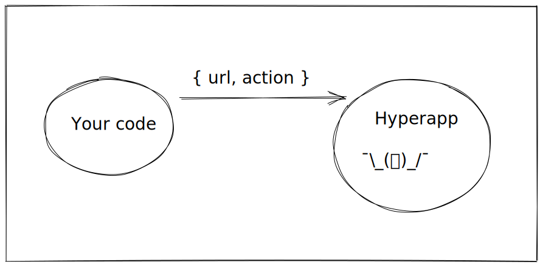
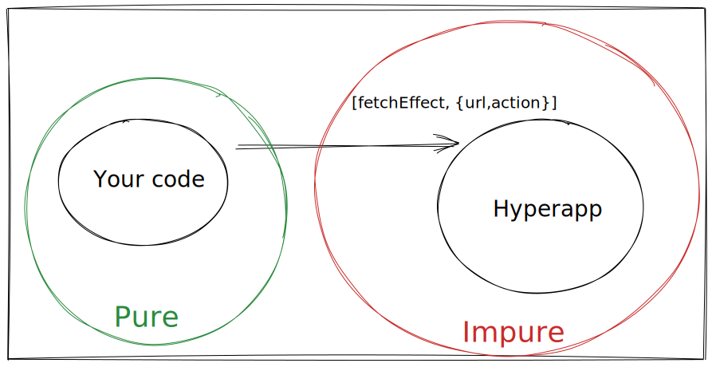

# Chapter 6: Effects as data
## Understanding side-effects
All actions you’ve seen so far were simple state transitions from one data structure to the other.
However, in real-world scenarios, your application will probably have to deal with side-effects, e.g. making HTTP calls to the API.
A typical functional approach to side-effects is to move them to the edges of the system. But, let’s start from the ground up.

Imagine the following hypothetical code you could write:
```js
const SetPosts = (state, posts) => ({
  ...state,
  posts
});
const LoadLatestPosts = (state) =>
  window.fetch("http://hyperapp-api.herokuapp.com/api/post")
    .then(response => response.json())
    .then(data => SetPosts(state, data));
```
`LoadLatestPosts` uses browser Fetch API to get data from the server.
When the data arrives, it invokes a simple state transition function to set the posts in the local state.
Since `fetch` causes side effects (going over the wire with HTTP) it makes your entire program side-effectful.

## Understanding "effects as data"
It only takes one innocent `fetch` call to make all your code impure. 
Fetching the data in your code is manageable when the app is small. 
Unfortunately, it makes it harder to think about the app when you have lots of functions all with their own fetch calls.

Also, with impure calls spread all over the place the testability suffers.
You may be used to mocking `fetch` in your tests, but have you ever asked yourself why you have to do that?

Let’s make a thought experiment in code. How can we represent the effect (making a fetch call) as a data structure?
```js
const SetPosts = (state, posts) => ({
  ...state,
  posts
});
const data = {
  url: "http://hyperapp-api.herokuapp.com/api/post",
  action: SetPosts
};
// const LoadLatestPosts = ??
```
Before we try to figure out how the `LoadLatestPosts` could look like, let’s explain the structure of the data it would need. 
`data` is an object. It has API `url` pointing to the resource that we want to load (`"http://hyperapp-api.herokuapp.com/api/post"`). 
After it’s loaded you want to call `SetPosts` action. You can think of `action: SetPosts` as a callback. 
While different effects need all kinds of input data, almost all effects use `action` to call when they're done. 

But how should Hyperapp know how to interpret this object?



Hyperapp is less than 500 lines of code. It can’t support all effects out of the box. 
There's no way it can translate arbitrary JS objects to every single side-effect you can imagine. 
Because of it, you must pass the side-effect function definition and the effect data as a two-argument array. 

```js
const SetPosts = (state, posts) => ({
  ...state,
  posts
});
const data = {
  url: "http://hyperapp-api.herokuapp.com/api/post",
  action: SetPosts
};
const LoadLatestPosts = [effectDefinition, data];
// We will explain effectDefinition in a moment
```
To summarize what we’ve learned so far. Side-effects in Hyperapp are made of the effect definition and the effect data:
```js
[effectDefinition, data]
```
In this book we'll call effect definitions with a lowercase letter. 

## Writing a new effect definition

Let’s move from the abstract `effectDefinition` to the actual code making HTTP GET `fetch` request.  Let’s call it `fetchEffect`
```js
const LoadLatestPosts = [fetchEffect, data];
```
Please note that the effect `LoadLatestPosts` starts with an uppercase letter, but
the effect definition from a lowercase one. This is the convention we follow in this book.

Hyperapp passes two arguments to the effect definition:
```js
const fetchEffect = (dispatch, data) => {};
```
Hyperapp will invoke your effect and inject a `dispatch` function that the effect definition will call. `data` is the data you pass to the effect. 
A simple implementation of the fetch effect definition may look like this:
```js
const fetchEffect = (dispatch, data) => {
  return window.fetch(data.url)
      .then(response => response.json())
      .then(json => dispatch(data.action, json));
};
```
As an effect library author, you translate the side-effectful API call (e.g. `fetch`) into a `dispatch` call. 
You will never call `fetch` directly outside of the effect definition.

Our original post-fetch action definition looked like this:
```js
const SetPosts = (state, posts) => ({
  ...state,
  posts
});
```
Remember that it’s passed as an action: 
```js
const data = {
  url: "http://hyperapp-api.herokuapp.com/api/post",
  action: SetPosts
};
```
When the effect calls `dispatch(data.action, json)` Hyperapp will call your action with the current state and pass the `json` from the API as the `posts` parameter. 

The effect definition **hides** the `fetch` call or any other impure API. You will never invoke the effect definition in the userland code yourself. 
When you pass the effect definition to the framework, it will call the impure code for you.

Didn’t we tell you that even a bit of side-effect makes the whole application impure? 
What’s the difference when you’re calling fetch directly versus Hyperapp calling it for you? 



In essence, it’s moving impure code to the edges of the system. 
The framework handles the impure part, while your code stays pure and declarative. 
It’s not possible to get rid of all impure code. Impure code makes changes to the world. It saves data,
sends notifications etc. At the same time, it's difficult to reason about. So leave it to the framework
and focus on the pure code yourself in your application code.

## Writing generic effects

It would be a little too repetitive to create `[effectDefinition, data]` array every time you want to make a fetch request. 
Especially because the effect definition that we called `fetchEffect` will always be the same. 
```js
const LoadLatestPosts = [fetchEffect, {
  url: "http://hyperapp-api.herokuapp.com/api/post",
  action: SetPosts
}];
const LoadSomethingElseExample = [fetchEffect, { 
/* data */
}];
```
To prevent that make a function that will hide the repetition:
```js
const Http = data => [fetchEffect, data];
```
Then, pass the actual effect data:
```js
const LoadLatestPosts = Http({
  url: "http://hyperapp-api.herokuapp.com/api/post",
  action: SetPosts
});
```

## Triggering effects on application startup

With fetch effect defined, you must decide when to invoke it. For now, you'll start fetching posts on application startup.

Modify `init` to invoke `LoadLatestPosts`. Change:
```js
app({
  init: state,
  ...  
});
```
to:
```js
app({
  init: [state, LoadLatestPosts],
  ...  
});
```
`init` has an overloaded signature. In addition to the initial state, you can pass one or more actions to invoke on startup.


With those changes in place, test your application. A list of posts from the server should arrive and replace the hard-coded posts.
You may observe a content flip as Hyperapp replaces initial state with the server posts.


If everything works fine, replace the initial posts with an empty array:
```js
const state = {
  currentPostText: "",
  posts: []
};
```
It will remove the initial flash of default data.

## Using "effects as data" in practice

In this section, you'll use an open-source library [hyperapp-fx](https://github.com/okwolf/hyperapp-fx) that implements the most common effects.


In **App.js** add `LoadLatestPosts` effect that invokes `SetPost` action on successful response:
```js
import { Http } from "hyperapp-fx";

const SetPosts = (state, posts) => ({
  ...state,
  posts
});

const LoadLatestPosts = Http({
  url: "http://hyperapp-api.herokuapp.com/api/post",
  action: SetPosts
});
```
`Http` function takes your effect data and builds a two-argument array of `[httpEffectDefinition, effectData]`.  
It’s a more generic version of our own `Http` function.

Add hyperapp-fx:
```json
{
  "dependencies": {
    "hyperapp": "2.0.14",
    "hyperapp-fx": "2.0.0-beta.2",
    "hyperlit": "0.3.6"
  }
}
```

And let Snowpack bundle it for the browser:

```npm i```
```npm start```

## Triggering Effects from Actions

You’re loading posts from the server, but what about adding new posts?

Create the `SavePost` effect:
```js
const SavePost = (post) =>
  Http({
    url: "http://hyperapp-api.herokuapp.com/api/post",
    options: {
      method: "post",
      headers: {
        "Content-Type": "application/json",
      },
      body: JSON.stringify(post),
    },
    action: (state, data) => state,
  });
```
This effect wraps HTTP POST. The `action` to be triggered on successful response is only a placeholder that doesn’t do anything useful yet. It only returns the state argument.

Change the `AddPost` action to trigger the `SavePost` effect.  

```js
const AddPost = state => {
  if (state.currentPostText.trim()) {
    const newPost = { 
      username: "anonymous",
      body: state.currentPostText
      };
    const newState = { 
      ...state,
      currentPostText: "",
      posts: [...state.posts, newPost]
    };
    return [newState, SavePost(newPost)];
  } else {
    return state;
  }
};
```
This action performs simple local state update and simultaneously triggers the effect.

## Triggering Multiple Effects

If you have more than one effect pass them comma-separated at the end of the main array:
```js
const ActionExample = oldState => [newState, Effect1, Effect2];
```
You can add as many effects as you need. Think of it as a batch of effects. 

To summarize this section, whenever you see `state`, you can replace it with `[state, effect*]` array. 
You can use it in the `app` `init`:
```js
app({
  init: [state, LoadLatestPosts],
  ...  
});
```
But, the same structure can be returned from an action. 
```js
const Action = state => {
  return [newState, Effect1, Effect2];
};
```

### Exercise: implementing own HTTP POST support

Enhance our own `fetchEffect` to handle POST requests. It should accept options similar to hyperapp-fx.
Once it works, move `fetchEffect` and `Http` into **lib/Http.js** and use it in **App.js**.

<details>
    <summary id="implementing_own_post">Solution</summary>

**lib/Http.js**
```js
const fetchEffect = (dispatch, data) => {
  return window
    .fetch(data.url, data.options)
    .then((response) => response.json())
    .then((json) => {
      return dispatch(data.action, json);
    });
};
export const Http = (data) => [fetchEffect, data];
```

**App.js**
```js
import { Http } from "./lib/Http.js";
```

</details>
