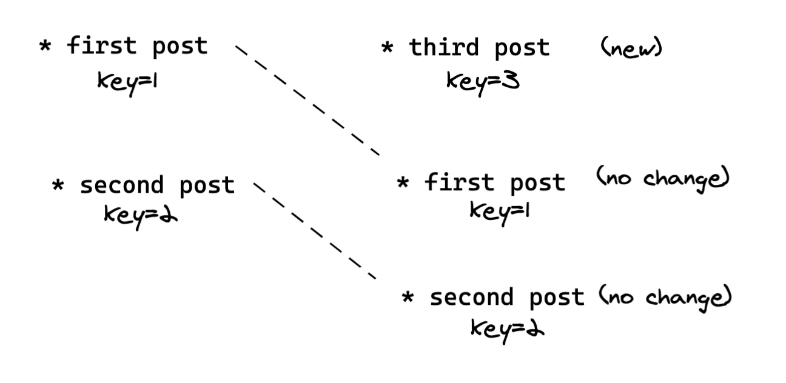
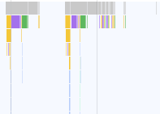

# Chapter 9: Runtime optimization

## Breaking from purity

"Effects/subscriptions as data" taken to the extreme means no side-effects in the userland code. 
```setTimeout``` becomes an effect, ````setInterval```` becomes a subscription. HTTP calls become effects, SSE become a subscription. 

What about things like `console.log` or `Math.random()`? 
Can you wrap them inside effects? Yes, but sometimes it's more convenient to use them directly. 

Our next requirement is to add unique identifiers to the posts.
Put the `guid` function into your code:
```js
const guid = () => {
    return 'xxxxxxxx-xxxx-4xxx-yxxx-xxxxxxxxxxxx'.replace(/[xy]/g,
      function (c) {
        var r = Math.random() * 16 | 0,
            v = c == 'x' ? r : (r & 0x3 | 0x8);
        return v.toString(16);
      }
    );
}
```
Don't worry about the growing size of the file. We'll solve this problem in the later chapters.

Modify the `AddPost` action to generate `id` for all new posts:
```js
    const newPost = {
      id: guid(),
      username: "anonymous",
      body: state.currentPostText,
    };
```

## Optimizing long lists of items 

Our application keeps adding new posts to the end of the list. But what would happen if you had to add them 
to the beginning of the list?


When Hyperapp compares previous and next list they differ. 
The old items got shifted by one. We know it, but the algorithm for the Virtual DOM diffing doesn't.
To maintain a stable list item identity between the renders, add a **key** attribute.



With the extra hint from the **key** attribute, Hyperapp avoids re-rendering the items that got shifted by one.

Modify the `listItem` view function to include the `key` attribute:
```js
const listItem = (post) => html`
  <li key=${post.id}>
    ...
  </li>
`;
```
Usually, the best candidate for the `key` value is a stable identifier (e.g. guid).
Some bad keys:
* post content because it may not be unique
* array index as it's not stable over re-renders

Since the `key` attribute is not visible in the generated DOM you can also add `data-key` attribute for debugging purposes:
```js
const listItem = (post) => html`
  <li key=${post.id} data-key=${post.id}>
    ...
  </li>
`;
```
Hyperapp internally uses `key`, so the `data-key` is only for you.

## Finding runtime performance bottlenecks

Switch `LoadLatestPosts` to fetch 1000 items when the application starts (notice new `url` value):
```js
const LoadLatestPosts = Http({
  url: "https://hyperapp-api.herokuapp.com/api/post?limit=1000",
  action: SetPosts,
});
```

Start typing a new post. 
On every typed character, Hyperapp has to do the Virtual DOM diffing of the entire page it controls. 
With a fast machine, the typing delay may not even be noticeable. Hyperapp is often fast enough without additional optimization. 

But, you want it to be fast on older machines and mobile phones as well. Go to your DevTools and slow down your CPU to make the impact of large DOM tree updates noticeable.


Record the CPU profile while typing the text. It should show significant time spent on JS execution.
We recommend profiling in the **Incognito mode** which usually has most browser extensions disabled.
Those extensions may significantly impact performance results. 


Zoom in on the slowest part, which is the widest yellow box in the flame chart:


Next, check the main contributors to performance problems. `render` function seems to be our bottleneck. 
But the `render` function belongs to Hyperapp so keep looking for the code that you wrote. 
Just below the `render` function, you should see a `view` function invoking `listItem`  repeatedly. 
The source of our bottleneck is the `listItem` function invoked multiple times when we type a new post.
Excessive `listItem` calls result in multiple `patch` function calls. It's Hyperapp patching physical DOM tree to keep
up with your changes. 

## Optimizing large DOM trees 

You want to avoid the unnecessary computation of the post list items when typing a new post text. 

Extract the `postList` view fragment:
```js
const postList = ({ posts }) => html`
  <ul>
    ${posts.map(listItem)}
  </ul>
`;
```
Use it in the `view` function:
```js
${postList({ posts: state.posts })}
```

Import `Lazy` function from Hyperapp:
```js
import { app, memo } from "./web_modules/hyperapp.js";
```
`memo` wraps view fragments that need to be optimized.

Decorate `postList` with `Lazy`:
```js
const lazyPostList = ({posts}) => memo(postList, {posts});
```
`memo` expects a `view` to optimize (`postList`) and properties (`posts`) that it will pass to the `view`.
The optimization implemented by `memo` is called **memoization**. 
`memo` remembers the input and output of the previous `postList` invocation. 
If you call it again with the same input, the `postList` doesn't compute anything, and `lazyPostList` returns the last result.

Replace `postList` with `lazyPostList`:
```js
${lazyPostList({posts: state.posts})}
```

Verify performance profile again.



Most key presses should generate a performance profile with much shorter JS blocking time.

`Lazy` is the last part of Hyperapp API you need to learn.  There's nothing more. Congratulations!

After this section remove the `limit` query param from the API `url`.

In the remaining chapters, we'll cover topics outside of Hyperapp core. But they are still crucial for day to day work.
You will learn about:
* testing
* routing
* integrating with 3rd party libraries
* rendering on the server
